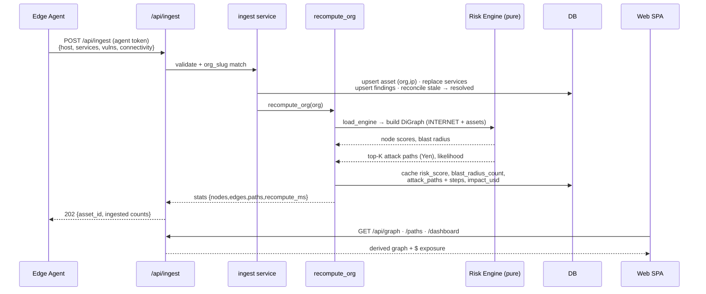
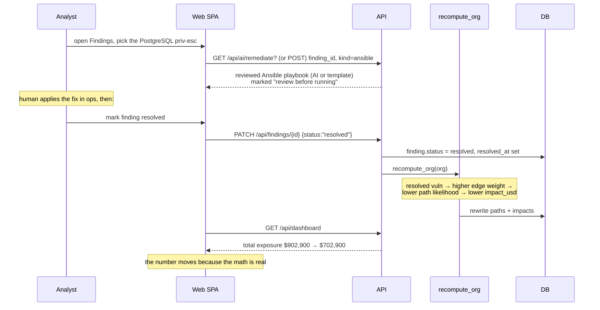
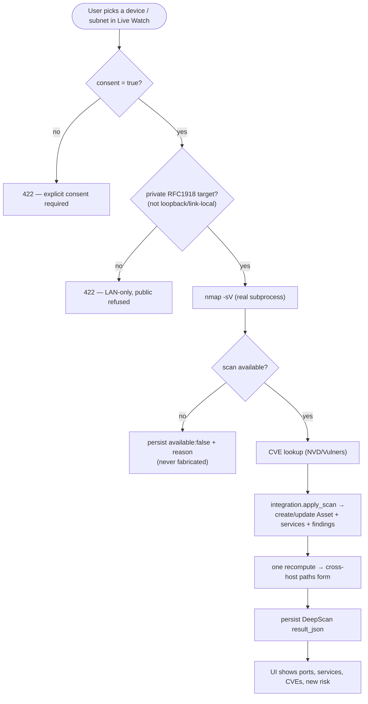
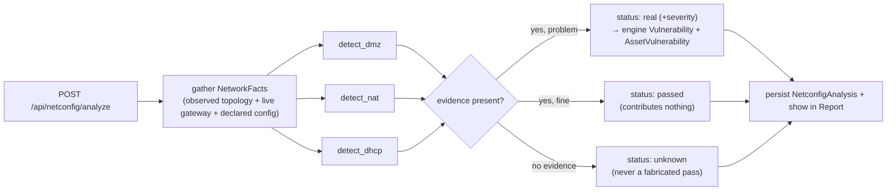
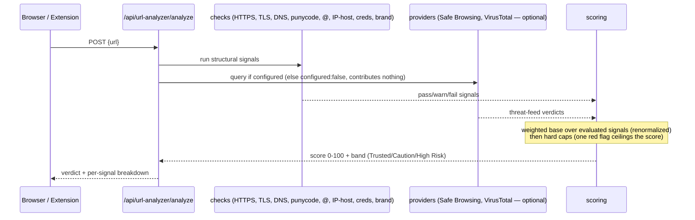
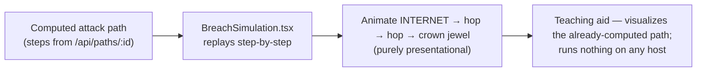
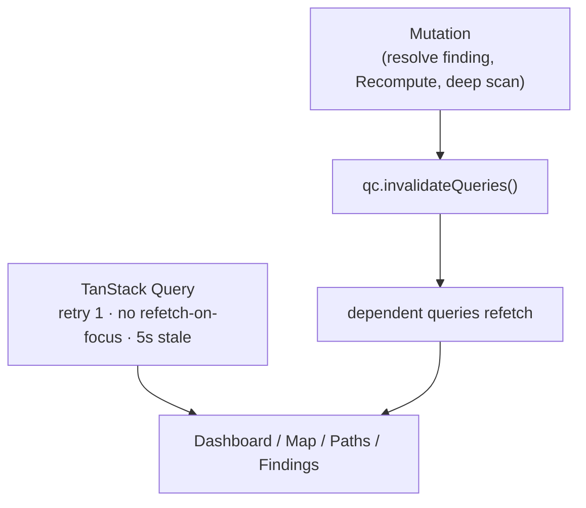

# Drishti — Application Flows

*Reverse-engineered end-to-end journeys and data flows, as Mermaid sequence/flow diagrams. Each maps to
real routes ([API_REFERENCE.md](API_REFERENCE.md)) and services.*

---

## 0. Navigation map

```mermaid
flowchart LR
    landing["/ Landing"] --> login["/login"]
    login --> home["/app (AppHome)"]
    home --> graph["/app/graph<br/>Attack Map"]
    home --> live["/app/live<br/>Live Watch"]
    home --> paths["/app/paths → /app/paths/:id"]
    home --> find["/app/findings"]
    home --> assets["/app/assets → /app/assets/:id"]
    home --> report["/app/report"]
    home --> url["/app/url-analyzer"]
    find --> remed["/app/remediate/:findingId"]
    home --> settings["/app/settings"]
```

Any `/app/*` URL without a session redirects to `/login` (`RequireAuth`).

---

## 1. Auth: register → login → refresh

```mermaid
sequenceDiagram
    participant U as Browser
    participant API as FastAPI
    participant DB as DB
    U->>API: POST /api/auth/register {name,email,password}
    API->>DB: create Org + User (bcrypt hash, role=analyst)
    API-->>U: 201 {user}
    U->>API: POST /api/auth/login {email,password}
    Note over API: verify vs bcrypt hash;<br/>if email unknown, verify DUMMY hash<br/>(timing-safe, no account-existence leak)
    API-->>U: 200 {access_token (15m), refresh_token (7d)}
    U->>API: GET /api/auth/me  (Bearer access)
    API-->>U: {id,email,role,org_name}
    Note over U,API: access expires →
    U->>API: POST /api/auth/refresh (Bearer refresh)
    Note over API: token_version must match user.token_version
    API-->>U: new {access, refresh}
```

**Token invalidation:** `PATCH /api/auth/me` with a new password bumps `user.token_version`; every token
minted earlier (which embeds the old version) then fails the `get_current_user` check — all sessions
logged out at once.

---

## 2. Ingest → recompute → visualize (the core loop)



---

## 3. The hero: resolve a finding → exposure drops live



`make smoke` runs exactly this and asserts the `$200,000` drop.

---

## 4. Attack Map interaction + demo attack

```mermaid
sequenceDiagram
    participant U as User
    participant W as Attack Map (React Flow)
    participant API as API

    W->>API: GET /api/graph
    API-->>W: nodes (INTERNET→gateway→assets+live devices),<br/>edges (weights, on_top_path), threat overlays
    U->>W: click asset node
    W-->>U: asset drawer (services, findings, blast radius)
    U->>W: click edge
    W->>API: GET /api/paths/{path_id}
    API-->>W: ordered steps → path drawer
    U->>W: "Run attack demo"
    W->>API: POST /api/live/demo-attack
    API-->>W: NetworkThreat[] (synthetic intruder, MITRE)
    Note over W: injected node pulses red with severity badge;<br/>gateway still shown, real devices intact
    U->>W: "Clear demo attack"
    W->>API: DELETE /api/live/demo-attack
```

The demo intruder is clearly labeled (`DEMO-ATTACK`, MAC `de:ad:be:ef:*`) so it's never confused with a
real device.

---

## 5. Live Watch: devices on the wire + threats

```mermaid
sequenceDiagram
    participant AG as Agent (devices mode, --consent-subnet)
    participant API as /api/live/*
    participant URL as URL Trust Analyzer
    participant DET as live_threats.detect_threats
    participant W as Live Watch

    loop every sweep
      AG->>API: POST /api/live/devices {IP,MAC,hostname,vendor,subnet,active_subnets}
      API->>API: dedupe (org,mac); mark WiFi-active devices online,<br/>stale (>90s / other subnet) offline
      AG->>API: POST /api/live/observe {domain}
      API->>URL: score domain → band + verdict
      URL-->>API: Trusted/Caution/High Risk
    end
    W->>API: GET /api/live/devices · /api/live/network-threats
    API->>DET: detect over live devices + domains + deep-scan CVEs
    DET-->>API: arp_spoof / rogue_device / risky_service / malicious_domain (+MITRE)
    API-->>W: force-map of live devices; threats highlighted
```

**WiFi-aware:** each sweep reports `active_subnets`; devices not on an active subnet (or unseen > 90 s)
drop off, so switching networks clears the old network and surfaces the new one.

---

## 6. Deep Scan (consent-gated)



Autoscan runs this on a schedule: always this host; the rest of the subnet only if `scan_subnet` is
explicitly authorized.

---

## 7. Network-config audit (NAT / DMZ / DHCP)



On a live network this yields **real** findings (DHCP inferred from the live gateway, flat-network/no-DMZ
from the live sweep, NAT boundary), not "unknown".

`GET /api/netconfig/last` returns the most recent analysis for the org.

---

## 8. URL Trust Analyzer (+ Web Guard extension)



The extension blocks/ warns on High-Risk navigation; Live Watch reuses the same scoring for observed
domains.

---

## 9. Breach Simulation (client-side, no exploit)



---

## 10. Data-fetching & cache invalidation (frontend)



Pressing **Recompute** in the Shell calls `POST /api/recompute` then invalidates all queries, so every
open view reflects the new model.
