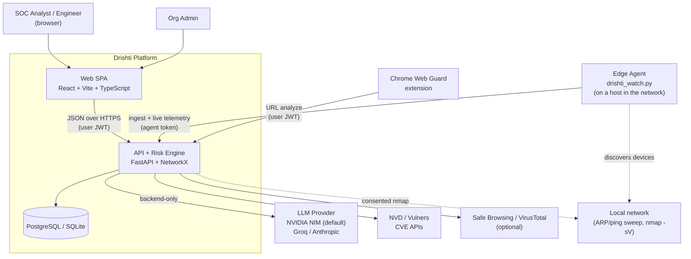
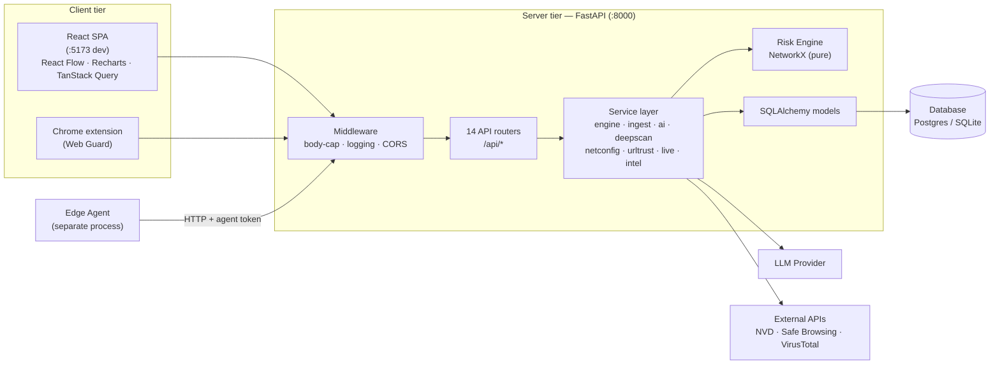
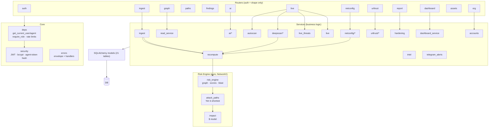
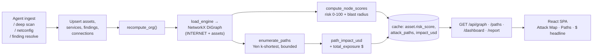
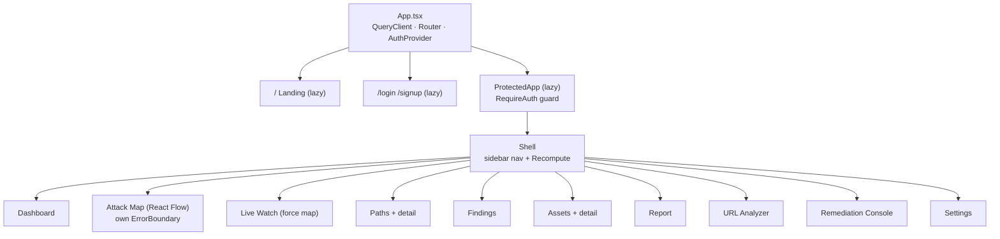

# Drishti — Architecture

*Reverse-engineered from the implemented product. C4-style views (context → container → component), data flow, deployment, and the design decisions that shaped them. Diagrams are Mermaid — they render on GitHub and in VS Code.*

*Last updated: 2026-08-21 — verified against source code at commit 1e68eb1.*

---

## 1. System context (C4 L1)

Who and what talks to Drishti.



**Trust boundaries:** the browser and extension carry a **user JWT**; the edge agent carries a hashed
**agent token**; the LLM key lives **only** on the backend. Every scan of the LAN is either the agent's
consented device sweep or a consent-gated, RFC1918-only deep scan.

**External integrations** (all outbound from backend, key-isolated):
- **LLM**: NVIDIA NIM (default, `meta/llama-3.3-70b-instruct`), Groq, or Anthropic (`claude-sonnet-5`).
 Configured via `AI_PROVIDER` + `AI_MODEL` env vars. Structured JSON output via provider-specific
 schema enforcement.
- **CVE lookup**: NVD free REST API (no key needed, rate-limited ~5 req/30s) or Vulners (if `VULNERS_KEY` set).
- **URL reputation**: Google Safe Browsing + VirusTotal (both optional; absent = `configured:false`).

---

## 2. Container view (C4 L2)



**Key files**:
- `server/app/main.py` — app assembly, lifespan bootstrap, middleware stack
- `server/app/config.py` — env settings (fail-closed JWT secret)
- `server/app/db.py` — engine/session + get_db dependency
- `server/app/db_init.py` — create_all + reconcile_columns
- `server/app/core/errors.py` — error envelope + handler registration

---

## 3. Backend component view (C4 L3)

Router → service → model, plus the pure engine core.



**Router inventory** (14 routers):
| Router file | Prefix | Purpose |
|-------------|--------|---------|
| `health.py` | `/` | Liveness/readiness |
| `auth.py` | `/api/auth` | Register, login, refresh, profile |
| `org.py` | `/api` | Org info, members, load-sample, reset, agent-token |
| `ingest.py` | `/api` | Agent data ingestion |
| `graph.py` | `/api` | Attack map graph data |
| `paths.py` | `/api` | Attack path listing + detail |
| `findings.py` | `/api` | Finding CRUD + status transitions |
| `assets.py` | `/api` | Asset CRUD |
| `ai.py` | `/api/ai` | Remediation, impact, predict, block, network-summary |
| `dashboard.py` | `/api` | Dashboard + stats + recompute trigger |
| `report.py` | `/api` | CVE report, distribution, hardening, ML summary |
| `live.py` | `/api` | Live watch: devices, domains, threats, deep-scan, autoscan |
| `netconfig.py` | `/api` | NAT/DMZ/DHCP audit |
| `urltrust.py` | `/api/url-analyzer` | URL trust analysis |

---

## 4. The core data flow: scan → price → visualize

The heart of the product. A change anywhere triggers a full recompute; the graph, paths, and dollars
are always derived, never stored raw.



**Why it feels alive:** resolving a finding raises the edge weight on that hop, which lowers path
likelihood, which lowers `impact_usd`, which lowers total exposure — all recomputed in one pass
(`$902,900 → $702,900`, asserted by `make smoke`).

**Recompute triggers** (any of these calls `recompute_org`):
- Agent ingest (`POST /api/ingest`)
- Finding status change (`PATCH /api/findings/{id}`)
- Asset edit (`PATCH /api/assets/{id}`)
- Manual trigger (`POST /api/recompute`)
- Sample network load (`POST /api/org/load-sample`)

**Concurrency control**: Postgres advisory lock (`pg_advisory_xact_lock(hashtext(org_id))`) serializes
concurrent recomputes for the same org. Skipped on SQLite.

---

## 5. Live network + threat overlay

How the *real* network reaches the Attack Map, and how threats light it up.

```mermaid
flowchart TB
 agent["Edge agent<br/>dns/history/conn/devices mode<br/>(consent)"] -->|"ARP/ping sweep<br/>IP·MAC·hostname·vendor"| dev["/api/live/devices"]
 agent -->|"open-tab / DNS domains"| dom["/api/live/observe"]
 agent -->|"active tabs/apps"| sync["/api/live/sync-active"]
 dev --> ndev[("NetworkDevice<br/>dedupe (org,mac)")]
 dom --> url["URL Trust Analyzer<br/>score + band"] --> lobs[("LiveObservation")]
 ndev --> detect["live_threats.detect_threats()"]
 lobs --> detect
 deep["deep scan CVEs"] --> detect
 detect --> nt["NetworkThreat<br/>arp_spoof·rogue·risky_service·malicious_domain<br/>+ MITRE"]
 ndev --> graph["read_service.build_graph"]
 nt --> graph
 graph -->|"INTERNET→gateway→devices<br/>threatened nodes pulse"| map["Attack Map + Live force map"]
 demo["Run attack demo<br/>inject_demo()"] --> nt
```

The gateway is **always** rendered (even after it's been deep-scanned into an asset); raw devices and
deep-scanned assets hang off it. Threatened nodes carry `threat_kind` / `threat_severity` / `mitre` and
pulse red on the map.

**Live-only gate**: once any `NetworkDevice` row exists for an org, the attack map filters to only
show assets whose IP appears in the live device set (online + refreshed within 90s). This means:
- A fresh boot shows an empty map that fills only with real agent-discovered devices
- An offline machine drops off
- `DEMO_SEED=1` data renders without gating (no device rows exist yet)

**Agent modes** (`drishti_watch.py`, 946 lines, 4 modes):
- **`dns`** — passive DNS resolver history + passive certificate transparency host extraction
- **`history`** — browser history correlation (local SQLite + Chrome History JSON)
- **`conn`** — live TCP connections via `psutil` (hostname, local/remote IP, ports)
- **`devices`** — ARP/ping sweep of the local subnet (IP, MAC, hostname, vendor)

The legacy `drishti_agent.py` remains as a minimal ingest-only agent; `drishti_watch.py` is the
primary, full-featured edge agent.

---

## 6. Frontend structure



**Code-split chunks** (public vs app):
- Landing/auth are separate lazy chunks — the marketing page never downloads React Flow / Recharts
- `ProtectedApp` is lazy-loaded only after auth

**State management**:
- **TanStack Query** — server state (API calls, caching, refetching)
- **Zustand** — client state (toasts, graph focus state in `graphStore.ts`)

**Key libraries**:
- React Flow — attack map graph rendering
- Recharts — dashboard charts (severity distribution, etc.)
- Tailwind CSS — styling
- Motion (Framer Motion) — animations
- Vitest — testing

---

## 7. Deployment topology

```mermaid
flowchart LR
 subgraph dev["Local (make up)"]
 d_web["web :5173 (Vite)"]
 d_api["server :8000 (uvicorn)"]
 d_db[("SQLite / PG")]
 d_agent["agent (auto-started conn mode)"]
 d_web --> d_api --> d_db
 d_agent --> d_api
 end

 subgraph prod["Hosted"]
 p_web["Vercel<br/>(web/vercel.json)"]
 p_api["Render<br/>(render.yaml)"]
 p_db[("Managed Postgres<br/>postgres:// → psycopg v3)"]
 p_web -->|"CORS allow-list"| p_api --> p_db
 end
```

**Local** (`make up`):
- Web: Vite dev server on `:5173`
- API: uvicorn on `:8000`
- DB: SQLite (`drishti.db`) or Postgres if `DATABASE_URL` set
- Agent: auto-started in `dev` mode (devices + WiFi discovery)

**Production**:
- Frontend: Vercel (static deploy from `web/`)
- Backend: Render (Docker from `server/Dockerfile` + `render.yaml`)
- Database: Managed Postgres (psycopg v3)
- CORS: explicit allowlist (no `*`)

**Known issue — vercel.json / Railway URL mismatch**: `web/vercel.json` rewrites API calls to a
Railway-style hostname, but the production backend is deployed on Render. This causes API requests
from the deployed frontend to hit the wrong origin. The rewrite target needs to be updated to match
the actual Render service URL.

**Bootstrap on boot** (`main.lifespan`):
1. `Base.metadata.create_all(engine)` — create missing tables
2. `reconcile_columns(engine)` — add missing columns additively
3. Backfill legacy device subnets (`backfill_device_subnets`)
4. Seed: identity-only (default) or Acme demo (`DEMO_SEED=1`)
5. Start autoscan scheduler (skipped under pytest)
6. Start Telegram alert dispatcher (if keys configured)
7. Auto-start edge agent (dev environments only)

Every step is try/except-wrapped so a failure logs and continues rather than blocking the app.

---

## 8. Key design decisions

| Decision | Rationale | Source |
|----------|-----------|--------|
| **Pure engine, separate persistence** | `risk_engine`/`attack_paths`/`impact` are pure functions over NetworkX; `recompute.py` owns all writes. Makes the math unit-testable and the demo explainable. | `risk_engine.py`, `recompute.py` |
| **Engine-authoritative dollars** | The AI narrates but the endpoint overwrites its number with the engine's — the figure is deterministic and auditable, never model-invented. | `impact.py`, `ai/service.py` |
| **Live-only by default** | Fresh boot seeds identity only; map/dashboard/live show *only* real agent-discovered devices. `DEMO_SEED=1` opts into the sample. No fabricated device ever ships. | `main.py` bootstrap, `read_service.py` live-only gate |
| **Honesty model everywhere** | netconfig `unknown`, deepscan `available:false`, urltrust `configured:false` — a check that can't run says so; it never fakes a pass or invents a CVE. | `netconfig/`, `deepscan/`, `urltrust/` |
| **Defensive-only, consent-gated** | No exploit path exists in code. LAN scans require consent + RFC1918 target. The agent discloses per-mode scope. AI output is guarded against offensive content. | `deepscan/service.py`, agent docstring, AI prompts |
| **Bounded enumeration** | Yen's k-shortest with hop/candidate/top-K caps — never enumerate the combinatorial simple-path set; recompute stays < 500 ms. | `attack_paths.py` |
| **UUID-string PKs** | 36-char strings work identically on Postgres and SQLite, so local dev/tests and prod share one schema. | `models/base.py` |
| **Additive `reconcile_columns`, no Alembic** | Deliberate v1 simplification — adds missing columns safely so a stale dev DB doesn't 500; destructive changes recreate the DB. | `db_init.py` |
| **Code-split frontend** | Landing/auth/app are separate lazy chunks so the marketing page never pays for React Flow. | `App.tsx` |
| **Nested error boundaries** | A React Flow crash on the Attack Map is isolated; the rest of the app stays up. | `components/ErrorBoundary.tsx` |
| **Timing-safe login** | Unknown emails still run bcrypt against a precomputed dummy hash — response time doesn't leak account existence. | `core/security.py` |
| **Streaming body cap** | `MaxBodySizeMiddleware` rejects >1MB bodies before buffering — protects `/ingest` from pre-auth DoS. | `main.py` |
| **Deterministic graph layout** | Server-side layered layout (zone-based columns, left→right) so the graph doesn't jump between renders. | `graph_layout.py` |
| **Concurrent ingest safety** | SAVEPOINT-based race handling — a concurrent upsert that wins the race is adopted instead of 500-ing. | `services/ingest.py` |
| **NVIDIA NIM as default AI provider** | Migrated from Groq to NVIDIA NIM (`meta/llama-3.3-70b-instruct`) as the default LLM provider, with Groq and Anthropic remaining as alternatives. NVIDIA NIM offers larger context windows and consistent model availability. | `config.py`, `ai/client.py` |

---

## 9. Directory map (source of truth)

```
server/app/
 main.py app assembly, lifespan bootstrap, middleware
 config.py env settings (fail-closed JWT secret)
 db.py / db_init.py engine/session + create_all & reconcile_columns
 core/ security (JWT, bcrypt, agent-token hash), deps (auth, rate limits), errors
 api/ auth ingest graph paths findings ai dashboard report
 live netconfig urltrust org assets health
 services/
 risk_engine.py graph, node scores, edge weights, blast radius ← pure
 attack_paths.py Yen k-shortest enumeration, path risk/likelihood ← pure
 impact.py $ model, total exposure ← pure
 recompute.py orchestration: build → score → paths → impact → cache
 engine_loader.py DB → engine NodeData/EdgeData
 read_service.py build_graph (React Flow payload + live devices + threats)
 ingest.py idempotent upsert + reconcile + recompute
 ai/ client, prompts, service (remediate/impact/predict), mocks
 deepscan/ scanner(nmap), cve_lookup(NVD/Vulners), parser, integration, service
 netconfig/ facts, detectors(DMZ/NAT/DHCP), integration, service
 urltrust/ analyzer, checks, network, providers, scoring, summary, whois
 intel.py network intelligence: CVE aggregation, risk-band distribution, ML (IsolationForest + KMeans), AI network summary
 telegram_alerts.py background Telegram notification dispatcher (30s polling for high/critical findings + threats)
 live.py device/domain observe, WiFi-aware tracking, coverage
 live_threats.py detect_threats + demo inject/clear
 autoscan.py per-org scheduled deep-scan
 hardening.py per-node quantified hardening recommendations
 dashboard_service.py dashboard + stats aggregation
 accounts.py register, profile, org management, sample loading
 models/ 21 SQLAlchemy tables (see DATA_MODEL.md)
 schemas/ Pydantic contracts (see API_REFERENCE.md)
 seed/ acme.py (sample + identity), load.py
web/src/
 App.tsx / ProtectedApp.tsx routing + auth guard
 features/* one folder per screen
 components/ Shell, primitives, UI, ErrorBoundary
 api/ client + types
 store/ Zustand (toasts, graph)
 lib/ format utilities
agent/drishti_watch.py primary edge agent (946 lines): live watch — dns/history/conn/devices modes, WiFi-aware tracking
agent/drishti_agent.py legacy agent (minimal, ingest-only)
extension/ Chrome Web Guard (background, options, warning popup)
```

---

## 10. Background services

| Service | File | Trigger | Frequency |
|---------|------|---------|-----------|
| **Autoscan scheduler** | `services/autoscan.py` | `asyncio` loop | Every 20s, checks due orgs |
| **Telegram alerts** | `services/telegram_alerts.py` | `threading.Thread` daemon | Every 30s, scans for new high/critical findings + threats |
| **Edge agent** | `agent/drishti_watch.py` | Auto-started in dev | 4 modes: `dns`, `history`, `conn`, `devices` |

---

## 11. Configuration reference

| Env var | Default | Purpose |
|---------|---------|---------|
| `APP_ENV` | `""` (treated as production) | `local`/`dev`/`test` allows default JWT secret |
| `DATABASE_URL` | `sqlite:///./drishti.db` | Database connection |
| `JWT_SECRET` | `change-me` | HS256 signing key (fail-closed in production) |
| `JWT_ACCESS_MINUTES` | `15` | Access token TTL |
| `JWT_REFRESH_DAYS` | `7` | Refresh token TTL |
| `CORS_ORIGINS` | `http://localhost:5173` | Comma-separated allowlist |
| `AI_PROVIDER` | `nvidia` | `groq`, `nvidia`, or `anthropic` |
| `AI_MODEL` | `""` (provider default) | Override model name |
| `AI_MOCK` | `False` | Use canned fixtures instead of real LLM |
| `AI_MAX_TOKENS` | `2500` | LLM response limit |
| `AI_TIMEOUT_SECONDS` | `45.0` | LLM call timeout |
| `GROQ_API_KEY` | `""` | Groq API key |
| `NVIDIA_API_KEY` | `""` | NVIDIA NIM API key |
| `NVIDIA_BASE_URL` | `""` | NVIDIA NIM API base URL |
| `ANTHROPIC_API_KEY` | `""` | Anthropic API key |
| `NVD_API_KEY` | `""` | NVD CVE lookup key (optional) |
| `VULNERS_KEY` | `""` | Vulners CVE lookup key (alternative to NVD) |
| `DEEPSCAN_TIMEOUT_SECONDS` | `120.0` | nmap -sV timeout |
| `DEEPSCAN_MAX_HOSTS` | `32` | hosts per nmap batch |
| `DEEPSCAN_MAX_TOTAL_HOSTS` | `256` | hard ceiling across batches |
| `DEEPSCAN_RATE_LIMIT_SECONDS` | `1.0` | delay between NVD API calls |
| `DEEPSCAN_NVD_BATCH_SIZE` | `10` | CVEs per NVD batch request |
| `DEEPSCAN_VULNERS_BATCH_SIZE` | `1000` | CVEs per Vulners batch request |
| `URLTRUST_TIMEOUT_SECONDS` | `10.0` | URL trust analysis timeout |
| `BREACH_COST_BASE` | `500000.0` | Dollar model base cost per breach |
| `INGEST_MAX_BYTES` | `1048576` (1 MB) | Body size cap |
| `AUTO_SEED` | `True` | Seed org identity on fresh DB |
| `DEMO_SEED` | `False` | Seed Acme sample network on boot |
| `TELEGRAM_BOT_TOKEN` | `""` | Telegram bot token (optional) |
| `TELEGRAM_CHAT_ID` | `""` | Telegram chat ID (optional) |
