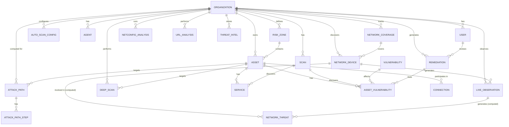

# Drishti — Data Model

*Reverse-engineered from the implemented codebase. All 21 SQLAlchemy tables, their columns, relationships, constraints, and how they relate to each other.*

*Last updated: 2026-08-21 — Verified against source code at commit 1e68eb1.*

---

## 1. Entity relationship overview

**Legend:** Entities in ALL CAPS are tables; `NETWORK_THREAT` is a **computed view** (not a stored table) derived from `NetworkDevice` and `LiveObservation` data by the `detect_threats()` engine. Rate limiting (`TokenBucket`) is in-memory only, no table. Refresh tokens are JWT-based, no table.

---

## 2. Table reference (alphabetical)

### Agent

Hashed agent credentials for the edge agent. Replaces the older `AgentToken` pattern.

| Column | Type | Nullable | Notes |
|--------|------|----------|-------|
| id | String (UUID) | No | PK |
| org_id | String | No | FK → Organization.id |
| agent_key | String (64) | No | Agent identifier |
| token_hash | String (255) | No | SHA256 of plaintext token |
| label | String (120) | Yes | Human-readable label |
| last_seen_at | DateTime | Yes | Updated on each authenticated call |
| status | String (20) | No | `active` / `disabled` |
| created_at | DateTime | No | UTC |

Unique: `(org_id, agent_key)`.

**Security**: Plaintext token is returned once at issuance, never stored.

### Asset (Asset model, ASSET table)

A host/device in the org's attack surface.

| Column | Type | Nullable | Notes |
|--------|------|----------|-------|
| id | String (UUID) | No | PK |
| org_id | String | No | FK → Organization.id |
| zone_id | String | Yes | FK → RiskZone.id (nullable) |
| hostname | String (255) | Yes | Nullable in code |
| ip | String (45) | No | IPv4 or IPv6 |
| os | String (120) | Yes | OS string |
| asset_type | String (20) | No | `server`, `database`, `workstation`, `firewall`, `router`, `webapp`, `iot`, `cloud` |
| criticality | String (20) | No | `critical`, `high`, `medium`, `low` |
| business_value | Numeric(14,2) | No | Default: 10000.00 |
| internet_facing | Boolean | No | True for externally reachable assets |
| risk_score | Numeric(6,3) | Yes | 0-100, recomputed by engine (nullable) |
| blast_radius_count | Integer | Yes | Count of downstream nodes (nullable) |
| meta | JSON | Yes | Free-form metadata (nullable) |
| first_seen_at | DateTime | No | First time asset was observed |
| updated_at | DateTime | No | UTC |

Unique constraint: `(org_id, ip)`.

Index: `ix_assets_org_internet` on `(org_id, internet_facing)`.

**Note**: `is_crown_jewel`, `downstream_value_usd`, and `last_scanned_at` were removed from the model. `is_crown_jewel` is now computed by the engine (score >= 70 or critical asset in crown_jewel zone). `downstream_value_usd` is now derived from the attack-path engine. `last_scanned_at` moved to `NetworkDevice` and `DeepScan`.

### AssetVulnerability

A finding: this asset is affected by this vulnerability. Formerly named `Finding`.

| Column | Type | Nullable | Notes |
|--------|------|----------|-------|
| id | String (UUID) | No | PK |
| org_id | String | No | FK → Organization.id |
| asset_id | String | No | FK → Asset.id |
| vulnerability_id | String | No | FK → Vulnerability.id |
| service_id | String | Yes | FK → Service.id (nullable) |
| status | String (20) | No | `open`, `remediating`, `resolved`, `accepted` |
| detected_at | DateTime | No | UTC |
| resolved_at | DateTime | Yes | UTC |

Unique: `(asset_id, vulnerability_id)`.

Index: `ix_findings_org_status` on `(org_id, status)`.

### AttackPath

A ranked attack path from an entry point to a target asset.

| Column | Type | Nullable | Notes |
|--------|------|----------|-------|
| id | String (UUID) | No | PK |
| org_id | String | No | FK → Organization.id |
| entry_label | String (120) | No | Entry point label (e.g. `INTERNET`) |
| target_asset_id | String | No | FK → Asset.id |
| hop_count | Integer | No | Number of hops in path |
| path_risk | Numeric(6,3) | No | Aggregated risk score |
| likelihood | Numeric(4,3) | No | Path likelihood |
| impact_usd | Numeric(14,2) | No | Dollar impact |
| narrative | String | Yes | Human-readable description |
| computed_at | DateTime | No | UTC |

Index: `ix_paths_org_risk` on `(org_id, path_risk)`.

### AttackPathStep

One hop in an attack path, ordered by step_index.

| Column | Type | Nullable | Notes |
|--------|------|----------|-------|
| id | String (UUID) | No | PK |
| path_id | String | No | FK → AttackPath.id |
| step_index | Integer | No | Order within path |
| asset_id | String | No | FK → Asset.id |
| via_vulnerability_id | String | Yes | FK → Vulnerability.id (nullable) |
| edge_weight | Numeric(6,3) | Yes | Weight of the traversed edge (nullable) |

Unique: `(path_id, step_index)`.

### AutoScanConfig

Per-org autonomous deep-scan schedule. One row per org.

| Column | Type | Nullable | Notes |
|--------|------|----------|-------|
| id | String (UUID) | No | PK |
| org_id | String | No | FK → Organization.id |
| enabled | Boolean | No | Default False |
| interval_seconds | Integer | No | Default 420 (7 min) |
| scan_subnet | Boolean | No | Default False — scans only self device if False |
| cursor | Integer | No | Round-robin position |
| last_run_at | DateTime | Yes | UTC |

Unique: `(org_id)` (one config per org).

### Connection

Directed edge between two assets.

| Column | Type | Nullable | Notes |
|--------|------|----------|-------|
| id | String (UUID) | No | PK |
| org_id | String | No | FK → Organization.id |
| from_asset_id | String | No | FK → Asset.id |
| to_asset_id | String | No | FK → Asset.id |
| relation | String (20) | No | `network`, `admin`, `trust`, `exposure` |
| weight | Numeric(6,3) | Yes | Edge weight (nullable) |
| note | String (255) | Yes | Human note (nullable) |
| created_at | DateTime | No | UTC |

Unique: `(from_asset_id, to_asset_id, relation)`.

### DeepScan

Result of a deep-scan run on a specific asset.

| Column | Type | Nullable | Notes |
|--------|------|----------|-------|
| id | String (UUID) | No | PK |
| org_id | String | No | FK → Organization.id |
| asset_id | String | Yes | FK → Asset.id (nullable when scan unavailable) |
| target_ip | String (45) | No | IP that was scanned |
| available | Boolean | No | False if scan/lookup failed |
| unavailable_reason | String (255) | Yes | Why scan failed |
| result_json | JSON | No | Full DeepScanResult as JSON |
| created_at | DateTime | No | UTC |

### LiveObservation

A domain observed by an agent or user.

| Column | Type | Nullable | Notes |
|--------|------|----------|-------|
| id | String (UUID) | No | PK |
| org_id | String | No | FK → Organization.id |
| domain | String (255) | No | Observed domain (cleaned) |
| url | String | No | Full URL |
| band | String (20) | No | Trust band: `Trusted`, `Caution`, `High Risk` |
| score | Numeric(5,1) | No | 0-100 score |
| verdict_json | JSON | No | Trimmed UrlAnalysisResult JSON |
| source_host | String (255) | Yes | IP of the observing device |
| hit_count | Integer | No | Repeat visit counter |
| first_seen | DateTime | No | UTC |
| last_seen | DateTime | No | UTC (updated on each observation) |

Unique: `(org_id, domain)`.

### NetworkCoverage

One row per network known to exist for an org — whether or not it has been inventoried.

| Column | Type | Nullable | Notes |
|--------|------|----------|-------|
| id | String (UUID) | No | PK |
| org_id | String | No | FK → Organization.id |
| ssid | String (64) | Yes | Wireless SSID (nullable) |
| subnet | String (45) | Yes | Subnet CIDR (nullable) |
| gateway_ip | String (45) | Yes | Gateway IP (nullable) |
| label | String (120) | Yes | Human label (nullable) |
| status | String (24) | No | `inventoried`, `reachable_not_scanned`, `seen_not_joined`, `unreachable` |
| evidence | String (255) | No | Why we believe this network exists |
| device_count | Integer | No | Number of known devices |
| last_seen | DateTime | No | UTC |

### NetworkDevice

A device discovered by the edge agent.

| Column | Type | Nullable | Notes |
|--------|------|----------|-------|
| id | String (UUID) | No | PK |
| org_id | String | No | FK → Organization.id |
| mac | String (32) | Yes | MAC address (nullable for off-link/L3 devices) |
| ip | String (45) | No | Device IP |
| subnet | String (45) | Yes | Observed CIDR (nullable) |
| subnet_inferred | Boolean | No | True for legacy /24 guesses |
| source_agent_id | String (64) | Yes | Agent that discovered this |
| label | String (120) | Yes | Human-readable label |
| discovery | String (8) | No | `arp` or `l3` |
| hostname | String (255) | Yes | DNS hostname |
| vendor | String (120) | Yes | MAC vendor (OUI lookup) |
| is_self | Boolean | No | True for the agent's own host |
| is_gateway | Boolean | No | True for the gateway |
| online | Boolean | No | Online status |
| last_scanned_at | DateTime | Yes | When last deep-scanned (nullable) |
| first_seen | DateTime | No | UTC |
| last_seen | DateTime | No | UTC (stamped on each agent heartbeat) |

Unique: `(org_id, mac)` for MAC-present devices; `(org_id, subnet, ip)` for null-MAC devices (partial unique index).

### NetconfigAnalysis

One row per network-configuration analysis run. Stores the full findings result as JSON.

| Column | Type | Nullable | Notes |
|--------|------|----------|-------|
| id | String (UUID) | No | PK |
| org_id | String | No | FK → Organization.id |
| used_declared_config | Boolean | No | True if declared config was used |
| real_findings | Integer | No | Count of real findings |
| result_json | JSON | No | Full analysis findings result |
| created_at | DateTime | No | UTC |

### Organization

Top-level tenant.

| Column | Type | Nullable | Notes |
|--------|------|----------|-------|
| id | String (UUID) | No | PK |
| name | String (200) | No | Org name |
| slug | String (80) | No | URL-safe slug |
| created_at | DateTime | No | UTC |
| updated_at | DateTime | No | UTC |

Unique: `(slug)`.

### Remediation (Remediation model, REMEDIATIONS table)

Generated or requested fix for a finding.

| Column | Type | Nullable | Notes |
|--------|------|----------|-------|
| id | String (UUID) | No | PK |
| org_id | String | No | FK → Organization.id |
| asset_vulnerability_id | String | No | FK → AssetVulnerability.id |
| kind | String (20) | No | `ansible`, `shell`, `cloud_cli`, `manual` |
| title | String (255) | No | Remediation title |
| summary | String (Text) | No | Markdown summary |
| script | String (Text) | No | Fix script / commands |
| risk_reduction | Numeric(5,2) | Yes | 0-100 proportion reduced (nullable) |
| generated_by | String (20) | No | `ai` or `human` |
| model | String (60) | Yes | Model identifier used (nullable) |
| reviewed | Boolean | No | Human-in-the-loop flag |
| details_json | JSON | Yes | Steps / requires_restart / disclaimer |
| created_at | DateTime | No | UTC |

### RiskZone

A risk zone (DMZ, internal, crown_jewel, cloud) that groups assets.

| Column | Type | Nullable | Notes |
|--------|------|----------|-------|
| id | String (UUID) | No | PK |
| org_id | String | No | FK → Organization.id |
| name | String (120) | No | Display name |
| kind | String (20) | No | `dmz`, `internal`, `crown_jewel`, `cloud` |
| description | String (Text) | Yes | Human description (nullable) |

Check: `kind IN ('dmz','internal','crown_jewel','cloud')`.

### Scan

A scan run — either agent ingest or deep scan.

| Column | Type | Nullable | Notes |
|--------|------|----------|-------|
| id | String (UUID) | No | PK |
| org_id | String | No | FK → Organization.id |
| agent_id | String | Yes | FK → Agent.id (nullable) |
| started_at | DateTime | No | UTC |
| finished_at | DateTime | Yes | UTC (nullable) |
| asset_count | Integer | No | Assets discovered |
| vuln_count | Integer | No | Vulnerabilities found |
| status | String (20) | No | `running`, `complete`, `failed` |

Check: `status IN ('running','complete','failed')`.

### Service

A detected service on an asset.

| Column | Type | Nullable | Notes |
|--------|------|----------|-------|
| id | String (UUID) | No | PK |
| org_id | String | No | FK → Organization.id |
| asset_id | String | No | FK → Asset.id |
| scan_id | String | Yes | FK → Scan.id (nullable) |
| port | Integer | No | Port number |
| protocol | String (8) | No | `tcp`, `udp` |
| name | String (120) | No | Service name (e.g. `nginx`) |
| version | String (80) | Yes | Service version (nullable) |

Unique: `(asset_id, port, protocol)`.

### ThreatIntel

Future / Web3 vision threat intelligence (stubbed, not used in v1 flows).

| Column | Type | Nullable | Notes |
|--------|------|----------|-------|
| id | String (UUID) | No | PK |
| org_id | String | Yes | FK → Organization.id (nullable) |
| indicator_hash | String (128) | No | Indicator hash |
| ttp_tags | JSON | Yes | TTP tags (nullable) |
| shared_at | DateTime | No | UTC |
| source | String (20) | No | `local` or `network` |

Check: `source IN ('local','network')`.

### URL Analysis (UrlAnalysis model, URL_ANALYSES table)

Full result of a URL trust analysis. History is tracked within this same table (no separate history table).

| Column | Type | Nullable | Notes |
|--------|------|----------|-------|
| id | String (UUID) | No | PK |
| org_id | String | No | FK → Organization.id |
| url | String | No | Original URL |
| score | Numeric(5,1) | No | 0-100 |
| band | String (20) | No | `Trusted`, `Caution`, `High Risk` |
| result_json | JSON | No | Full UrlAnalysisResult as JSON |
| created_at | DateTime | No | UTC |

### User

Application user.

| Column | Type | Nullable | Notes |
|--------|------|----------|-------|
| id | String (UUID) | No | PK |
| org_id | String | No | FK → Organization.id |
| name | String (120) | Yes | Display name (nullable) |
| email | String (255) | No | Normalized (lowercase, stripped) |
| password_hash | String (255) | No | SHA256 + bcrypt |
| role | String (20) | No | `admin`, `analyst`, `viewer` |
| token_version | Integer | No | Incremented on password change → invalidates all tokens |
| created_at | DateTime | No | UTC |
| updated_at | DateTime | No | UTC |

Unique: `(org_id, email)`.

### Vulnerability

CVE record (populated from NVD / Vulners / agent).

| Column | Type | Nullable | Notes |
|--------|------|----------|-------|
| id | String (UUID) | No | PK |
| cve_id | String (30) | Yes | CVE ID (e.g. `CVE-2024-1234`) (nullable) |
| title | String (255) | No | |
| description | String (Text) | Yes | (nullable) |
| cvss | Numeric(3,1) | No | CVSS score, default 5.0 |
| severity | String (20) | No | `critical`, `high`, `medium`, `low` |
| exploitability | Numeric(3,2) | No | 0-1, default 0.30 |
| cwe | String (30) | Yes | CWE ID (nullable) |
| discovered_at | DateTime | No | UTC |

Unique: `(org_id, cve_id)` (cve_id itself is also unique).

---

## 3. How tables map to API responses

| Table | Key endpoint | Transformation |
|-------|-------------|----------------|
| Asset | `GET /assets` | `AssetSummary` Pydantic schema — risk_score, blast_radius_count from engine cache |
| Asset | `GET /assets/{id}` | `AssetDetail` — joins services + findings + computed fields |
| RiskZone | `GET /assets/zones` | `RiskZoneOut` — with asset count |
| Connection | `GET /graph` | NetworkX edge + `onTopPath` annotation |
| AssetVulnerability | `GET /findings` | `FindingOut` — asset_ip joined |
| NetworkDevice | `GET /live/devices` | `NetworkDeviceOut` — adds threat fields |
| LiveThreat | `GET /live/threats` | `LiveThreat` — computed from LiveObservation + NetworkDevice data |
| NetworkThreat | `GET /live/network-threats` | `NetworkThreat` — computed threat list from live engine |
| Scan | `GET /dashboard` | Counted in stats |
| Remediation | `GET /remediation` | `RemediationOut` — with disclaimer |
| UrlAnalysis | `GET /url-analyzer/history` | `UrlAnalysisResult` — queried from url_analyses |
| DeepScan | `POST /live/deep-scan` | `DeepScanResult` |
| AttackPath | `GET /graph` | Attack path annotations on graph |
| AutoScanConfig | `GET/PUT /live/autoscan` | `AutoScanConfigOut` / `AutoScanConfigUpdate` |

---

## 4. Derived / cached columns

These columns are written by `recompute_org()` and are **not** set by the ingest pipeline:

| Column | Table | Source |
|--------|-------|--------|
| `risk_score` | Asset | Engine node score (0-100) |
| `blast_radius_count` | Asset | Engine blast radius count |
| `is_crown_jewel` | Asset | Engine: score >= 70 or critical asset in crown_jewel zone |

These are written by the attack-path enumeration:

| Column | Table | Source |
|--------|-------|--------|
| `onTopPath` | Connection edge annotation | Attack path engine |
| `path_id` | Connection edge annotation | Attack path ID |

---

## 5. Soft vs hard state

| Pattern | Usage | Rationale |
|---------|-------|-----------|
| Soft delete | N/A | No soft-delete pattern in v1 |
| Status field | `AssetVulnerability.status` | Workflow: open -> remediating -> resolved/accepted |
| Auto-resolve | `AssetVulnerability` stale entries | Agent removed a service; finding no longer applies |
| Time-bounded acceptance | `AssetVulnerability.accepted_until` | Risk accepted for a window; auto-resumes monitoring after expiry |
| Demo label | `NetworkDevice.label` | Separates demo from real devices; cleared on demo stop |

---

## 6. UUIDs everywhere

All primary keys are 36-character UUID strings (not UUID columns). This ensures:
- **Postgres + SQLite compatibility**: string PKs work identically on both backends
- **No migration conflicts**: append-only schema changes (reconcile_columns)
- **No special types**: standard VARCHAR, no UUID extension needed

---

## 7. Schema evolution

| Approach | Rationale |
|----------|-----------|
| **No Alembic** | Deliberate v1 simplification |
| `reconcile_columns(engine)` | Additive: adds missing columns safely |
| `create_all(engine)` | Creates missing tables (idempotent) |
| Full reset | `POST /api/org/reset` drops all data (admin only) |
| DB recreation | In dev, `make dev-db` drops and recreates |
| DB init | `server/app/db_init.py` seeds initial data |

---

## 8. Idempotency rules (ingest)

| Entity | Idempotency key | On collision |
|--------|----------------|--------------|
| Asset | `(org_id, ip)` | Update if found; keep operator-criticality; never downgrade |
| Service | `(asset_id, port, protocol)` | Replace (upsert) |
| AssetVulnerability | `(asset_id, vulnerability_id)` | Replace (upsert); stale open findings auto-resolve |
| Connection | `(from_asset_id, to_asset_id, relation)` | Skip duplicates |
| Scan | `(org_id, source, started_at)` | New row per ingest call |
| NetworkDevice | `(org_id, mac)` or `(org_id, subnet, ip)` | Update timestamps; subnets only observed by that agent |
| LiveObservation | `(org_id, domain)` | Update hit_count + last_seen |
| AttackPath | `(org_id, entry_label, target_asset_id, computed_at)` | Replace all steps |
| Remediation | `(asset_vulnerability_id, kind, generated_by)` | Replace (upsert) |

**Note**: `NodeHardening` is NOT an idempotent entity — it is computed on-the-fly by the hardening engine from live data, not persisted to a table.

---

## 9. Complete table inventory

21 tables total across 9 model files:

| # | Table | Model | Model File |
|---|-------|-------|------------|
| 1 | `organizations` | Organization | `models/org.py` |
| 2 | `users` | User | `models/org.py` |
| 3 | `agents` | Agent | `models/org.py` |
| 4 | `risk_zones` | RiskZone | `models/asset.py` |
| 5 | `assets` | Asset | `models/asset.py` |
| 6 | `services` | Service | `models/asset.py` |
| 7 | `connections` | Connection | `models/asset.py` |
| 8 | `vulnerabilities` | Vulnerability | `models/vuln.py` |
| 9 | `asset_vulnerabilities` | AssetVulnerability | `models/vuln.py` |
| 10 | `remediations` | Remediation | `models/remediation.py` |
| 11 | `network_devices` | NetworkDevice | `models/live.py` |
| 12 | `live_observations` | LiveObservation | `models/live.py` |
| 13 | `network_coverage` | NetworkCoverage | `models/live.py` |
| 14 | `autoscan_configs` | AutoScanConfig | `models/live.py` |
| 15 | `deep_scans` | DeepScan | `models/live.py` |
| 16 | `scans` | Scan | `models/scan.py` |
| 17 | `threat_intel` | ThreatIntel | `models/scan.py` |
| 18 | `netconfig_analyses` | NetconfigAnalysis | `models/netconfig.py` |
| 19 | `url_analyses` | UrlAnalysis | `models/urltrust.py` |
| 20 | `attack_paths` | AttackPath | `models/path.py` |
| 21 | `attack_path_steps` | AttackPathStep | `models/path.py` |

---

## 10. Removed / non-persistent entities

| Name | Status | Notes |
|------|--------|-------|
| `AIRequest` / `ai_requests` | Never existed | AI calls are not logged to a DB table |
| `RefreshToken` / `refresh_tokens` | Never existed | Refresh tokens are JWT-based (in-memory decode) |
| `TokenBucket` / `token_buckets` | Never existed | Rate limiting is in-memory (see `core/deps.py`) |
| `URL Analysis History` / `url_analysis_history` | Never existed | History is tracked in the `url_analyses` table |
| `LiveThreat` / `NetworkThreat` (table) | Never existed | Computed dynamically from `NetworkDevice` + `LiveObservation` by `detect_threats()` |
| `NodeHardening` (table) | Never existed | Computed on-the-fly by `services/hardening.py`, returned as a Pydantic schema |
| `AgentToken` | Removed | Replaced by `Agent` model with `agent_key` + `token_hash` |
