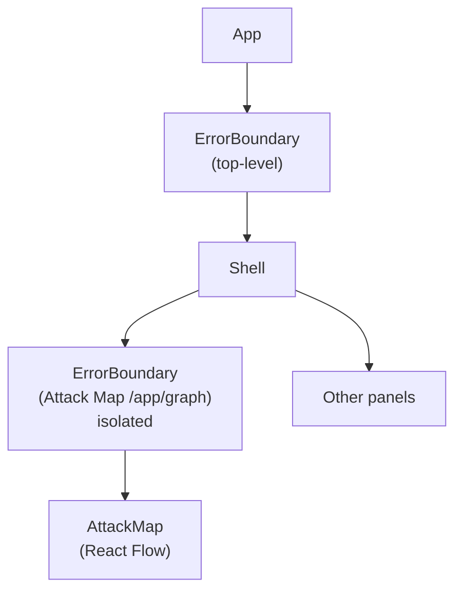

# Drishti — UX & UI Pattern Catalog

*Reverse-engineered from the implemented frontend. Every screen, data contract, interaction
pattern, visual language, and component layout — mapped from `web/src/`.*

*Last updated: 2026-08-21 — verified against source code at commit 1e68eb1.*

---

## 1. Screen catalog (frontend routing)

```mermaid
flowchart TB
 root["/"] --> landing["Landing<br/>(public marketing page)"]
 root --> auth["AuthShell (lazy)<br/>login / signup forms"]
 root --> app["/app/* — ProtectedApp (lazy)<br/>RequireAuth guard"]
 
 subgraph protected["Authed routes (inside /app/*)"]
 home["/app → AppHome<br/>onboarding / post-login hub"]
 graph["/app/graph → AttackMap<br/>React Flow graph + sidebar<br/>(isolated ErrorBoundary)"]
 paths["/app/paths → PathsPage<br/>path summary table"]
 pathDetail["/app/paths/:id → PathDetailPage<br/>path detail + blast radius"]
 findings["/app/findings → FindingsPage<br/>finding rows + Patch/Fix actions"]
 assets["/app/assets → AssetsPage<br/>asset rows"]
 assetDetail["/app/assets/:id → AssetDetailPage<br/>asset detail panel"]
 url["/app/url-analyzer → UrlAnalyzerPage<br/>URL input + score gauge + history"]
 report["/app/report → ReportPage<br/>hardening + CVE tables + AI summary"]
 live["/app/live → LiveWatchPage<br/>force graph + device panel"]
 remediate["/app/remediate/:findingId → RemediationConsole<br/>RemediationOut + Run / Configure"]
 settings["/app/settings → SettingsPage<br/>agent mode + agent log + toggles"]
 end

 app --> protected
```

**Code-split chunks** (4 public/app boundaries):
1. Root App — loads nothing heavy; sets up QueryClient, BrowserRouter, AuthProvider
2. Landing/auth (separate lazy chunks) — never loads React Flow / Recharts / feature code
3. ProtectedApp (lazy-loaded) — fetched only after auth; includes Shell + route definitions
4. Each route component is individually lazy-loaded

**Route transitions:** `animate-page-enter` CSS class on each route container — fade/slide-up on pathname change. Disabled under `prefers-reduced-motion`.

---

## 2. Visual language & theming

### Light / dark mode
- CSS custom properties on `:root`; redefined under `@media (prefers-color-scheme: dark)`
- Three states: explicit `data-theme="dark"`, explicit `data-theme="light"`, system default (prefers-color-scheme)
- All colors use token references — never hard-coded values

### Color system (token names)
| Token | Purpose |
|-------|---------|
| `--bg-primary` / `--bg-secondary` | Page, card, elevated |
| `--text-primary` / `--text-secondary` | Headings, body |
| `--accent-primary` | Interactive elements |
| `--border` | Dividers |
| `--shadow` | Card elevation |

### Typography
- System font stack (not imported web fonts)
- Three sizes used: `text-2xl` (section), `text-xl` (sub-section), `text-sm` (table/compact)
- Weights: 400, 500, 600, 700

### Motion
- **Framer Motion** (imported as `motion` / `AnimatePresence` / `LayoutGroup`)
- Shared layout animations between graph / panel / sub-panel
- Entrance: `initial={{ opacity: 0, y: 8 }}` → `animate={{ opacity: 1, y: 0 }}`
- Exit: `exit={{ opacity: 0 }}` with `transition={{ duration: 0.15 }}`
- Corner duration: `0.15–0.3s` (never long)
- List stagger: `staggerChildren` with `staggerDelay: 0.05` for card grids

### Panels
- Left: **Graph panel** — wider (controls + subject panel)
- Right: **Scope panel** — narrower (context + status + filters)
- On the homepage (solo, no right panel): click a node → detail expands inline
- Sub-panel behavior: `// --- entry mode ---`, `// --- detail mode ---`, `// --- entity mode ---` — each is a conditionally rendered `<section>` swapping the right panel content
- Network detail is **never** collapsible — it always fills the panel

---

## 3. Error boundaries



- **Top-level boundary**: catches everything, replaces the app with a recovery message
- **Attack Map boundary**: isolated from the rest — if React Flow throws, other panels continue
- No per-panel boundaries on panels (a panel failure renders the panel area, not the whole app)

---

## 4. Motion catalog (by screen)

### Attack Map (React Flow)
- Nodes fade in from center
- Selected node: handles show on demand + slight scale
- Hover: elevation change (shadow shift) rather than size change
- Edge highlights: `onTopPath` animated via React Flow's built-in `animated` prop
- Offline device overlay: colored dot opacity transition

### Dashboard (AppHome)
- Stat cards: each is a `motion.div` in a `StaggerContainer`
- Zone summary: accordion-style expand (see Accordion)

### Live Watch (force graph)
- Nodes repopulate gradually (`onLoad` callback in useForceEffect)
- Particle effect on threat nodes (red pulse — CSS animation)
- Demo attack injects trigger a re-render with label overlays

### Remediation Console
- Remediation card: `LayoutGroup` for shared layout (card ←→ detail)
- Expand/collapse: AnimatePresence for enter/exit
- Copy-to-clipboard: hover reveal of copy icon + click feedback
- Fix now: full-screen error view with retry/skip actions + details

---

## 5. Accordion (domain Accordion primitive)

| State | Behavior |
|-------|---------|
| Closed | Title + risk badge + count |
| Closed + hover | Subtle background lift |
| Open | Content area mounts; flow animation |
| Open + click another | Previous closes (single-open), not toggle |

Used by: Dashboard zone breakdown, Attack Paths summary, Network threats panel.

---

## 6. Keyboard & navigation

| Shortcut | Screen | Action |
|----------|--------|--------|
| `Escape` | All | Close modal/panel |
| `Enter` | Dashboard/Report | Scroll to section |
| `Tab` | All | Standard tab order |
| `Ctrl/Cmd + K` | Dashboard | Global search (planned) |

Focus ring: visible, custom branded color (not browser default).

---

## 7. Hover and click guidelines

| Pattern | Implementation |
|---------|---------------|
| Table row hover | `bg-primary` highlight (subtle) |
| Button hover | bg-color shift + shadow elevation |
| Clickable card | cursor pointer + subtle shadow change on hover |
| Copy-to-clipboard | Hover reveals icon; click triggers toast; also shows a "Copied!" toast after click |
| Interactive edge | React Flow hover highlights connected nodes (debounced) |

---

## 8. Copy patterns

### Confirmation
> "Are you sure? This will [description]."

### Error recovery
> "We couldn't [action]. [Specific reason]. Try [recovery step] or contact support."

### Empty states
> "No [items] yet. [CTA description]."

### AI disclaimer (always shown)
> "Outputs are AI-generated. Validate in your environment. This is advisory guidance, not a definitive fix."

### Token issuance (agent)
> "Your agent token has been generated. Copy it now — it will not be shown again."

---

## 9. Toasts

| Type | Color | Icon | Use case |
|------|-------|------|----------|
| Success | Green (theme-token) | Check | Copy, generate, save |
| Warning | Amber (theme-token) | Triangle | Deep scan unavailable, auto-resolve |
| Error | Red (theme-token) | Cross | AI failure, network error |
| Info | Blue (theme-token) | Info | Recompute triggered |

Duration: 4s auto-dismiss. Stack up to 3; older ones are replaced. Not interruptive for the system — the user dismisses explicitly if needed before timeout.

---

## 10. Form patterns

| Pattern | Validation | Error display |
|---------|-----------|---------------|
| Auth forms | Email format + password min 8 chars | Inline, beneath each field |
| URL analyze | URL format + reachable host | Inline beneath input |
| Deep scan | IP/CIDR + consent checkbox | Inline beneath each control |
| Settings toggle | Boolean switch | Immediate state update (no save button) |
| Asset edit | Title + optional fields | Inline, beneath each field |

---

## 11. Loading states

| Component | Loading state |
|-----------|--------------|
| Graph | Skeleton placeholder + spinner in node area |
| Dashboard | Skeleton cards (animated shimmer) |
| Tables | Row skeleton (4-5 rows) |
| AI remediation | Skeleton card (2-3 lines) |
| Deep scan | Full-screen modal with progress bar + nmap output streaming |

---

## 12. Theme-aware patterns

| Concern | Approach |
|---------|----------|
| Graphs | Colors adapt via token refs — no hard-coded node/edge colors |
| Severity colors | CSS custom properties or themed classes |
| Threat pulse | CSS animation (red) — works in both themes |
| Edge thickness | React Flow `style={{ strokeWidth }}` — theme-independent |

---

## 13. Component inventory (key UI components)

| Component | Location | Purpose |
|-----------|----------|---------|
| `Shell` | `web/src/components/Shell.tsx` | Top-level nav + page layout wrapper |
| `ErrorBoundary` | `web/src/components/ErrorBoundary.tsx` | Catches render errors |
| `Button` | `web/src/components/Button.tsx` | Shared button primitive |
| `StatCard` | `web/src/components/StatCard.tsx` | Dashboard hero stat card |
| `RiskPill` | `web/src/components/RiskPill.tsx` | Colored risk-level badge |
| `SeverityBadge` | `web/src/components/SeverityBadge.tsx` | Severity level indicator |
| `MoneyValue` | `web/src/components/MoneyValue.tsx` | Currency-formatted value display |
| `CodeBlock` | `web/src/components/CodeBlock.tsx` | Syntax-highlighted code block |
| `Drawer` | `web/src/components/Drawer.tsx` | Slide-in panel/drawer |
| `Toast` / `ToastHost` | `web/src/components/Toast.tsx` | Toast notification stack |
| `Landing` | `web/src/features/landing/Landing.tsx` | Public marketing landing page |
| `LoginPage` | `web/src/features/auth/LoginPage.tsx` | Login form |
| `SignupPage` | `web/src/features/auth/SignupPage.tsx` | Signup form |
| `AuthShell` | `web/src/features/auth/AuthLayout.tsx` | Auth page layout wrapper |
| `AuthProvider` | `web/src/auth.tsx` | Auth context provider |
| `AppHome` | `web/src/features/onboarding/AppHome.tsx` | Post-login onboarding hub |
| `Onboarding` | `web/src/features/onboarding/Onboarding.tsx` | Onboarding flow |
| `Dashboard` | `web/src/features/dashboard/Dashboard.tsx` | Dashboard screen |
| `AttackMap` | `web/src/features/graph/AttackMap.tsx` | React Flow attack graph |
| `GraphNode` | `web/src/features/graph/GraphNode.tsx` | Custom React Flow node |
| `BlastLegend` | `web/src/features/graph/BlastLegend.tsx` | Blast radius legend |
| `ForceMap` | `web/src/features/live/ForceMap.tsx` | Force-directed live graph |
| `LiveWatchPage` | `web/src/features/live/LiveWatchPage.tsx` | Live watch screen |
| `PathsPage` | `web/src/features/paths/PathsPage.tsx` | Attack paths listing |
| `PathDetailPage` | `web/src/features/paths/PathDetailPage.tsx` | Single path detail view |
| `PathDetailPanel` | `web/src/features/paths/PathDetailPanel.tsx` | Path detail side panel |
| `BreachSimulation` | `web/src/features/paths/BreachSimulation.tsx` | Breach simulation engine |
| `FindingsPage` | `web/src/features/findings/FindingsPage.tsx` | Findings list screen |
| `AssetsPage` | `web/src/features/assets/AssetsPage.tsx` | Assets list screen |
| `AssetDetailPage` | `web/src/features/assets/AssetDetailPage.tsx` | Single asset detail view |
| `AssetDetailPanel` | `web/src/features/assets/AssetDetailPanel.tsx` | Asset detail side panel |
| `UrlAnalyzerPage` | `web/src/features/urltrust/UrlAnalyzerPage.tsx` | URL trust analysis screen |
| `ReportPage` | `web/src/features/report/ReportPage.tsx` | Security report screen |
| `NetworkConfigSection` | `web/src/features/report/NetworkConfigSection.tsx` | Network config section in report |
| `RemediationConsole` | `web/src/features/remediation/RemediationConsole.tsx` | Remediation console screen |
| `SettingsPage` | `web/src/features/settings/SettingsPage.tsx` | Settings screen |
| `NeuralBackground` | `web/src/components/ui/flow-field-background.tsx` | Animated neural network background canvas |
| `AuroraBackground` | `web/src/components/ui/AuroraBackground.tsx` | Aurora gradient background effect |
| `Console` | `web/src/components/ui/console.tsx` | Terminal-style console output |
| `RouteFallback` | `web/src/App.tsx` | Suspense fallback spinner |
| `BackgroundLayer` | `web/src/App.tsx` | Conditional neural/landing background layer |

---

## 14. State management (client-side)

| Concern | Library | Scope |
|---------|---------|-------|
| Server state (API) | TanStack Query | All `api/` calls, cached by query key |
| Graph focus | Zustand (`store/graphStore.ts`) | Selected node, zoom, pan |
| Toasts | Zustand | Notification stack |
| Auth | React Context (`auth.tsx`) | User session, ready state |
| Theme | CSS custom properties + context | Light/dark/system |

---

## 15. Map type annotations (density reference)

| Type | Example | Enforce level |
|------|---------|--------------|
| page_id | `'/app/graph'` | allow — route string |
| field_id | `'risk_score'` | allow — data key |
| token_id | `'drishti_<base64>'` | allow — agent token |
| safe_html | `description | title` | allow — HTML fields |
| state_hash | `sha256(bytes).hex()[:16]` | allow — collision-resistant |
| url | `'https://nvd.nist.gov/…'` | allow — fetched externally |
