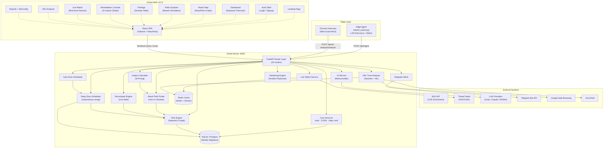
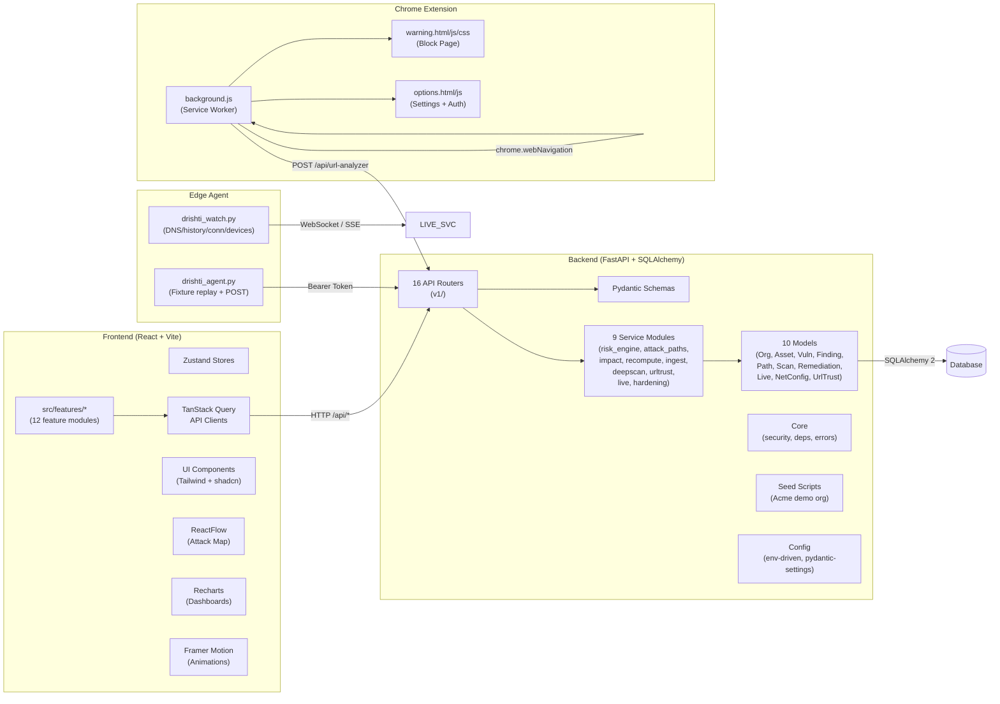
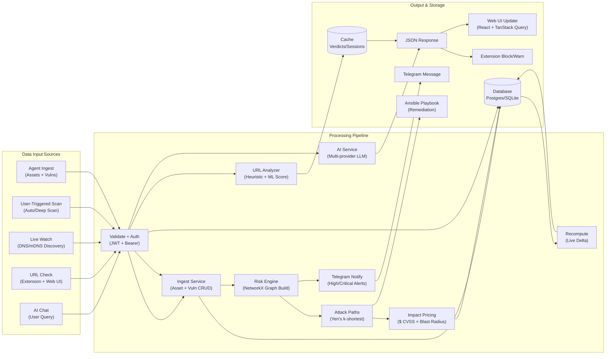
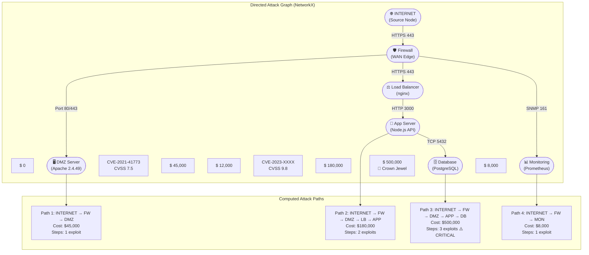
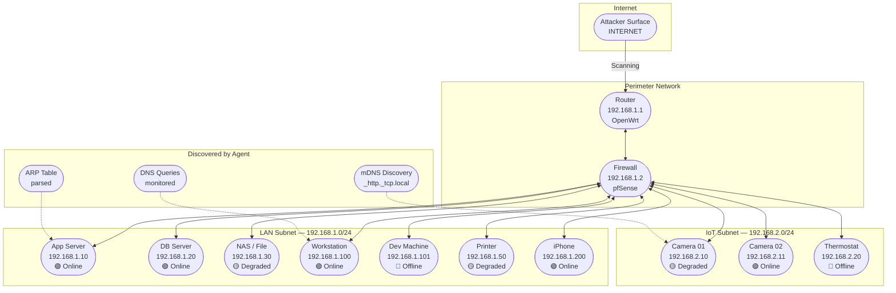
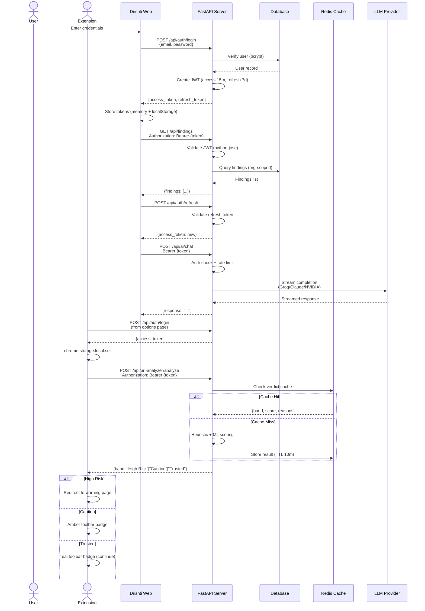
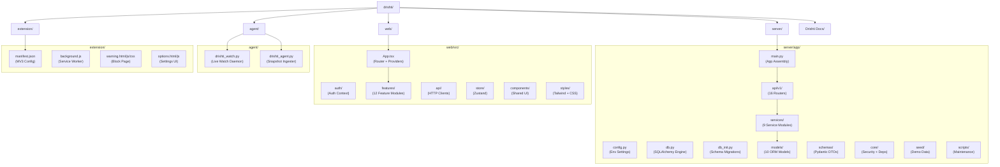
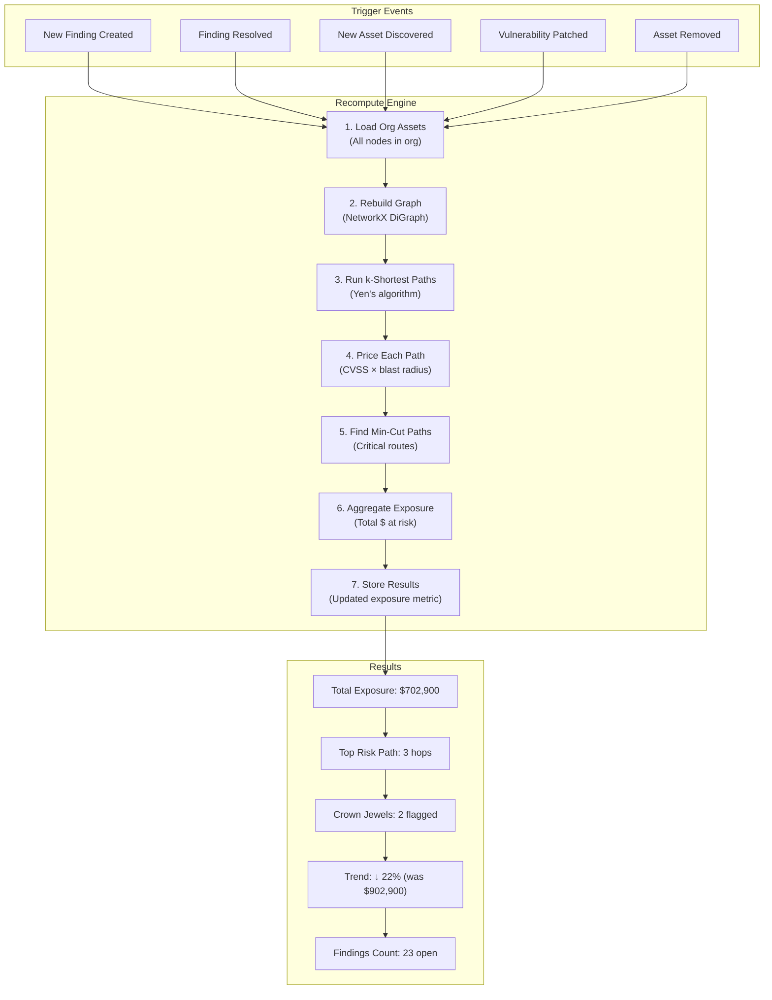

# ⚡ Drishti

**AI-powered defensive cybersecurity platform — maps, prices, and remediates attack paths. Never attacks.**

[](https://www.python.org/) [](https://fastapi.tiangolo.com/) [](https://react.dev/) [](https://www.typescriptlang.org/) [](https://tailwindcss.com/) [](https://networkx.org/) [](https://reactflow.dev/) [](https://redis.io/)

---

## 🔍 What is Drishti?

Drishti is a **defensive-only** attack-path intelligence platform. It models a network the way an attacker reads it, traces the real routes from the internet to crown-jewel assets, prices each path in **dollars**, and drafts human-reviewed **Ansible fix** playbooks — but it **never attacks**.

> **It resolves a finding → total org exposure recomputes live.** On the seeded demo, that's a real drop from `$902,900 → $702,900`, asserted by the test suite.

---

## ✨ Key Capabilities

| Capability | Description |
|---|---|
| **Risk Engine** | Directed graph (NetworkX) with Yen's k-shortest paths; computes INTERNET → asset attack routes |
| **Dollar Impact Pricing** | Every path and every node is priced in $ (CVSS-weighted, blast-radius-aware) |
| **Remediation Studio** | 3-column studio that drafts Ansible playbooks — human-reviewed, never auto-deployed |
| **Live Watch** | Real-time LAN device discovery, DNS telemetry, mDNS app detection, threat feed integration |
| **Deep Scan** | Autonomous nmap-based deep scan with scheduled triggers |
| **URL Trust Analyzer** | Heuristic + ML scoring of URL reputation; blocks or warns before navigation |
| **AI Assistant** | Multi-provider LLM (Groq Llama 3.3, Anthropic Claude, NVIDIA) with mock mode |
| **Chrome Extension** | "Drishti Web Guard" — MV3 browser extension for real-time URL blocking |
| **Telegram Alerts** | Real-time push notifications for high/critical findings |
| **Network Config** | Auto-generated network config export from scan results |
| **Findings Dashboard** | Severity-ranked vulnerability findings with CVE enrichment (NVD) |
| **21-table Data Model** | Multi-tenant SQLAlchemy 2 models with Alembic migrations |

---

## 🏗️ System Architecture



---

## 🧩 Component Architecture



---

## 🔄 Data Flow — End-to-End



---

## ⚔️ Risk Engine — Attack Path Graph Model



---

## 🌐 Network Topology — Live Watch



---

## 🔐 Authentication & Security Flow



---

## 📦 Repository Structure



---

## 🔁 Recompute & Exposure Tracking



---

## 🚀 Quick Start

### Prerequisites

- **Python 3.11+** with `uv` (recommended) or pip
- **Node.js 18+** with pnpm or npm
- **Redis** (optional, for verdict caching — falls back to memory)

### Backend

```bash
# Create virtual environment and install dependencies
cd server
python -m venv .venv && source .venv/bin/activate
pip install -r requirements.txt

# Configure environment
cp ../.env.example .env # adjust as needed

# Run the server (auto-seeds demo org on first boot)
uvicorn app.main:app --host 0.0.0.0 --port 8000 --reload
```

The server is now running at **http://localhost:8000** with auto-seeded demo data.

### Web Frontend

```bash
cd web
npm install
npm run dev
```

The web UI is now at **http://localhost:5173**.

### Edge Agent (Live Watch)

```bash
# Device discovery mode
python agent/drishti_watch.py --mode devices --discover-wifi --server http://localhost:8000 --token agent-demo-token

# Or ingest a scan fixture (demo)
python agent/drishti_agent.py --once \
 --fixture server/app/seed/fixtures/db-prod-01.json \
 --server http://localhost:8000 \
 --token agent-demo-token
```

### Chrome Extension (Web Guard)

1. Open `chrome://extensions` → toggle **Developer mode**
2. Click **Load unpacked** → select the `extension/` folder
3. Open extension options → configure server URL and log in

Demo credentials: `analyst@acme-retail.dev` / `drishti-demo`

---

## 🛠️ Tech Stack

### Backend

| Layer | Technology |
|---|---|
| Framework | FastAPI 0.115 |
| ORM | SQLAlchemy 2.0 + Alembic |
| Auth | python-jose (JWT) + bcrypt |
| Graph Engine | NetworkX 3.4 |
| ML/Stats | scikit-learn, numpy, scipy |
| Scheduling | APScheduler (deep scan) |
| Monitoring | prometheus-client, psutil |
| Parsing | beautifulsoup4, lxml, bleach |
| Feeds | feedparser, dnspython |
| CVE Data | nvdlib |

### Frontend

| Layer | Technology |
|---|---|
| Framework | React 18.3 + TypeScript |
| Build | Vite 5 |
| Styling | Tailwind CSS 3.4 |
| State | Zustand 4.5 |
| Data Fetching | TanStack Query 5.51 |
| Graph | ReactFlow 11.11 |
| Charts | Recharts 2.12 |
| Animation | Framer Motion 12.42 |
| Icons | Lucide React 0.427 |
| Testing | Vitest + Testing Library |

### Edge

| Component | Details |
|---|---|
| Agent | Python stdlib-only (no external deps) |
| Extension | Chrome MV3 (manifest v3) |
| Backend | Auto-starts on server boot (dev) |

---

## 📁 Repository Map

```
drishti/
├── server/ # FastAPI backend
│ ├── app/
│ │ ├── main.py # App assembly, lifespan, middleware
│ │ ├── config.py # Environment-driven settings
│ │ ├── db.py # SQLAlchemy engine + session
│ │ ├── db_init.py # Schema column reconciliation
│ │ ├── api/v1/ # 16 REST routers
│ │ │ ├── auth.py # JWT login/refresh
│ │ │ ├── ingest.py # Agent data ingestion
│ │ │ ├── graph.py # Graph data API
│ │ │ ├── paths.py # Attack path computation
│ │ │ ├── findings.py # Vulnerability findings
│ │ │ ├── ai.py # LLM chat/analysis
│ │ │ ├── live.py # Real-time telemetry
│ │ │ ├── netconfig.py # Network config export
│ │ │ ├── urltrust.py # URL reputation
│ │ │ ├── scan.py # Deep scan triggers
│ │ │ └── ...
│ │ ├── models/ # 10 SQLAlchemy ORM models
│ │ │ ├── org.py, asset.py, vuln.py
│ │ │ ├── finding.py, path.py, scan.py
│ │ │ ├── remediation.py, live.py
│ │ │ ├── netconfig.py, urltrust.py
│ │ ├── schemas/ # Pydantic request/response
│ │ ├── services/ # 9 business-logic modules
│ │ │ ├── risk_engine.py # NetworkX graph engine
│ │ │ ├── attack_paths.py # Yen's k-shortest
│ │ │ ├── impact.py # $ pricing model
│ │ │ ├── recompute.py # Live exposure delta
│ │ │ ├── ingest.py # Agent payload processing
│ │ │ ├── urltrust/ # URL scoring heuristics + ML
│ │ │ ├── deepscan/ # Autonomous nmap scanner
│ │ │ ├── netconfig/ # Network config generation
│ │ │ ├── live.py # Live watch orchestration
│ │ │ └── telegram_alerts.py
│ │ ├── core/ # Security, deps, error handlers
│ │ ├── seed/ # Acme demo network + fixtures
│ │ └── scripts/ # Maintenance utilities
│ ├── tests/ # pytest suite (232+ tests)
│ ├── requirements.txt
│ ├── pyproject.toml
│ └── run.py
├── web/ # React SPA
│ ├── src/
│ │ ├── App.tsx # Root router + providers
│ │ ├── features/ # 12 feature modules
│ │ │ ├── landing/ # Marketing page
│ │ │ ├── auth/ # Login / Signup
│ │ │ ├── dashboard/ # Exposure overview
│ │ │ ├── graph/ # Attack map (ReactFlow)
│ │ │ ├── paths/ # Breach simulation
│ │ │ ├── findings/ # Findings table
│ │ │ ├── remediation/ # 3-column studio
│ │ │ ├── live/ # Live watch (ForceMap)
│ │ │ ├── report/ # Reports + NetConfig
│ │ │ ├── settings/ # Org settings
│ │ │ └── urltrust/ # URL analyzer UI
│ │ ├── api/ # TypeScript API clients
│ │ ├── store/ # Zustand state
│ │ ├── components/ # Shared components
│ │ ├── lib/ # Utilities
│ │ └── styles/ # Tailwind + globals
│ ├── package.json
│ ├── vite.config.ts
│ └── Dockerfile
├── agent/ # Edge agent (stdlib-only Python)
│ ├── drishti_watch.py # Live watch daemon
│ └── drishti_agent.py # Snapshot ingester
├── extension/ # Chrome Web Guard (MV3)
│ ├── manifest.json
│ ├── background.js # Service worker
│ ├── options.html/js # Auth + settings
│ ├── warning.html/js/css # Block page
│ └── README.md
├── Drishti Docs/ # Full documentation suite
│ ├── PRD.md # Product Requirements
│ ├── TRD.md # Technical Requirements
│ ├── ARCHITECTURE.md # C4 diagrams + design decisions
│ ├── APP_FLOW.md # Sequence diagrams
│ ├── DATA_MODEL.md # ER diagram + table dictionary
│ ├── API_REFERENCE.md # Every endpoint documented
│ ├── SECURITY_MODEL.md # Defensive-only stance
│ └── UIUX.md # Design system spec
└── README.md ← you are here
```

---

## 🔬 Risk Engine — How It Works

```
 ┌──────────────────────────────────────────────────────┐
 │ INTERNET ──── Source Node (Entry Point) │
 └──────────────────────────────────────────────────────┘
 │
 ┌──────────────────▼──────────────────┐
 │ Build Directed Graph (NetworkX) │
 │ Nodes: Assets, Services, Vulns │
 │ Edges: Network paths, trust zones │
 └──────────────────┬──────────────────┘
 │
 ┌──────────────────▼──────────────────┐
 │ Yen's k-Shortest Paths Algorithm │
 │ Find all INTERNET → Crown Jewel │
 │ attack routes (weighted by CVSS) │
 └──────────────────┬──────────────────┘
 │
 ┌──────────────────▼──────────────────┐
 │ Dollar Impact Pricing │
 │ Path Cost = Σ(Exploit Cost + │
 │ Blast Radius × Asset) │
 │ Node Price = CVSS × Asset Value │
 └──────────────────┬──────────────────┘
 │
 ┌──────────────────▼──────────────────┐
 │ Blast Radius Analysis │
 │ If asset A is compromised, │
 │ which assets become reachable? │
 │ → Cascade impact calculation │
 └──────────────────┬──────────────────┘
 │
 ┌──────────────────▼──────────────────┐
 │ Ansible Remediation │
 │ Draft human-reviewed playbooks: │
 │ • Patch deployment │
 │ • Firewall rules │
 │ • Service hardening │
 │ NEVER auto-executed │
 └──────────────────────────────────────┘
```

### Scoring Model

| Factor | Weight | Description |
|---|---|---|
| CVSS Base Score | 40% | Vulnerability severity (0–10) |
| Asset Criticality | 30% | Crown jewel multiplier (1×–5×) |
| Exposure Score | 20% | Publicly reachable vs. segmented |
| Blast Radius | 10% | Downstream assets compromised if breached |

---

## 🔒 Security Model

```
┌─────────────────────────────────────────────────────────────────┐
│ DEFENSIVE-ONLY — Non-Negotiable Principles │
├─────────────────────────────────────────────────────────────────┤
│ │
│ ✅ Maps and prices attack paths │
│ ✅ Traces INTERNET → asset routes │
│ ✅ Drafts Ansible remediation playbooks │
│ ✅ Blocks navigation to high-risk URLs │
│ ✅ Sends real-time threat alerts │
│ ✅ Discovers devices on consented subnets │
│ │
│ ❌ Never launches exploits │
│ ❌ Never intercepts traffic │
│ ❌ Never auto-deploys fixes │
│ ❌ Never scans third-party systems without consent │
│ ❌ Never transmits raw packets │
│ │
│ 🔐 Auth: JWT (access 15m, refresh 7d) + Bearer tokens │
│ 🔐 Ext: chrome.storage (local + session) │
│ 🔐 Agent: Per-agent bearer tokens │
│ 🔐 Fail-open: Network/API failures → permit, never block │
│ 🔐 Input: bleach-sanitized, SQL injection safe (ORM) │
│ │
└─────────────────────────────────────────────────────────────────┘
```

---

## 🔌 API Reference

### Core Endpoints

| Method | Path | Description |
|---|---|---|
| `POST` | `/api/auth/login` | JWT login (email + password) |
| `POST` | `/api/auth/refresh` | Refresh access token |
| `GET` | `/api/auth/me` | Current user profile |
| `POST` | `/api/ingest` | Agent data ingestion (assets + vulns) |
| `GET` | `/api/assets` | List organization assets |
| `GET` | `/api/assets/{id}` | Asset detail with vulns |
| `GET` | `/api/findings` | Vulnerability findings |
| `GET` | `/api/findings/{id}/resolve` | Resolve finding → triggers recompute |
| `GET` | `/api/graph` | Network graph (nodes + edges) |
| `GET` | `/api/paths` | Computed attack paths |
| `GET` | `/api/paths/{id}` | Single path detail with dollar pricing |
| `GET` | `/api/ai/chat` | LLM chat (multi-provider) |
| `GET` | `/api/dashboard` | Exposure metrics + trends |
| `GET` | `/api/report` | Full network report |
| `GET` | `/api/netconfig` | Network config export |
| `GET` | `/api/live/devices` | Live-discovered devices |
| `GET` | `/api/live/threats` | Live threat feed |
| `POST` | `/api/scan/trigger` | Trigger deep scan |
| `GET` | `/api/scan/{id}` | Scan result |
| `POST` | `/api/url-analyzer/analyze` | URL reputation scoring |
| `GET/POST` | `/api/url-trust` | URL trust allow/deny list |

---

## 🧪 Testing

```bash
# Backend — pytest (232+ tests)
cd server
source .venv/bin/activate
pytest --tb=short -v

# Frontend — Vitest
cd web
npm test
```

---

## 📊 Demo Data

On first boot (with `DEMO_SEED=1`), the server auto-seeds the **Acme Retail** demo network:

| Asset | Type | CVSS | Dollar Value |
|---|---|---|---|
| web.acme-retail.dev | DMZ Web Server | 7.5 | $45,000 |
| api.acme-retail.dev | Application Server | 9.8 | $180,000 |
| db.acme-retail.dev | Database (Crown Jewel) | 9.1 | $500,000 |
| mail.acme-retail.dev | Mail Server | 6.1 | $15,000 |
| vpn.acme-retail.dev | VPN Gateway | 7.8 | $90,000 |
| **Total Exposure** | | | **$902,900** |

Login with `analyst@acme-retail.dev` / `drishti-demo` to explore.

---

## 📄 Documentation

Full documentation suite available in [`Drishti Docs/`](Drishti%20Docs/):

| Document | Content |
|---|---|
| [PRD.md](Drishti%20Docs/PRD.md) | Product requirements, personas, goals |
| [TRD.md](Drishti%20Docs/TRD.md) | Technical requirements, stack, formulas |
| [ARCHITECTURE.md](Drishti%20Docs/ARCHITECTURE.md) | C4 diagrams, design decisions, repo map |
| [APP_FLOW.md](Drishti%20Docs/APP_FLOW.md) | Sequence diagrams for all user journeys |
| [DATA_MODEL.md](Drishti%20Docs/DATA_MODEL.md) | ER diagram, 21-table dictionary |
| [API_REFERENCE.md](Drishti%20Docs/API_REFERENCE.md) | Every endpoint (method, auth, schema) |
| [SECURITY_MODEL.md](Drishti%20Docs/SECURITY_MODEL.md) | Defensive-only stance, consent gating |

---

## 🤝 Contributing

1. Fork the repository
2. Create a feature branch (`git checkout -b feat/amazing-feature`)
3. Commit your changes (`git commit -m 'feat: add amazing feature'`)
4. Push to the branch (`git push origin feat/amazing-feature`)
5. Open a Pull Request

All code must pass the existing test suites (232+ backend tests, frontend Vitest).

---

## 📜 License

MIT License — see [`LICENSE`](LICENSE) for details.

---

<div align="center">

**Drishti** — See the invisible. Price the risk. Fix it first.

*Defensive only. Maps, prices, and remediates. Never attacks.*

</div>
