# 👁️ Drishti

> **See the invisible. Price the risk. Fix it first.**

Drishti is a defensive cybersecurity platform that maps your network, prices every attack path in real dollars, and generates Ansible playbooks to close the gaps — before adversaries find them. Built on a graph-theoretic attack-surface engine, Drishti turns infrastructure chaos into actionable, prioritized remediation.

---

<div align="center">


**Defensive only. Maps, prices, and remediates. Never attacks.**

</div>

---

## 📑 Table of Contents

- [What Drishti Does](#-what-drishti-does)
- [Architecture Overview](#-architecture-overview)
- [System Architecture (C4)](#-system-architecture-c4)
- [Data Flow](#-data-flow)
- [Backend Deep Dive](#-backend-deep-dive)
- [Attack Graph Engine](#-attack-graph-engine)
- [Risk Scoring Model](#-risk-scoring-model)
- [Recompute & Exposure Tracking](#-recompute--exposure-tracking)
- [Authentication & Security](#-authentication--security)
- [Features](#-features)
- [Quick Start](#-quick-start)
- [Tech Stack](#-tech-stack)
- [Repository Map](#-repository-map)
- [Testing](#-testing)
- [Demo Network — Acme Retail](#-demo-network--acme-retail)
- [Documentation](#-documentation)
- [Contributing](#-contributing)

---

## 🎯 What Drishti Does

| Capability | What It Means |
|---|---|
| **Network Discovery** | Agents auto-discover devices via DNS, connection tables, and mDNS — zero manual entry |
| **Attack Graph** | NetworkX builds a directed graph of every asset; Yen's algorithm finds all Internet→crown-jewel paths |
| **Risk Pricing** | CVSS × criticality × blast radius → dollar exposure per asset and per attack path |
| **Breach Simulation** | Step through how an attacker would traverse your network, hop by hop |
| **Live Watch** | Real-time device telemetry with a force-directed topology map |
| **AI Remediation** | LLM-assisted remediation plans + Ansible playbook generation |
| **URL Trust** | Heuristic + ML scoring for URL reputation with WHOIS lookup |
| **Deep Scan** | Autonomous nmap scanning triggered on schedule or on demand |
| **Telegram Alerts** | Real-time push notifications for critical findings |
| **Chrome Guard** | MV3 extension that blocks malicious URLs at the browser |

---

## 🏗️ Architecture Overview

Drishti is a multi-tier, defensive security platform with four runtime planes:

```
┌─────────────────────────────────────────────────────────┐
│ 👤 Security Analyst │
│ ┌───────────────────────────────────────────────────┐ │
│ │ 🌐 Web UI (React + Vite + ReactFlow) │ │
│ │ Port 5173 · 12 feature modules │ │
│ └────────────────────┬──────────────────────────────┘ │
└───────────────────────┼─────────────────────────────────┘
 │ HTTPS (JWT Bearer)
 ▼
┌─────────────────────────────────────────────────────────┐
│ 🖥️ Backend API (FastAPI + SQLAlchemy) │
│ Port 8000 · 16 REST routers · 10 ORM models │
│ ┌──────────┐ ┌──────────┐ ┌──────────┐ ┌──────────┐ │
│ │ Risk │ │ Attack │ │ Deep │ │ URL │ │
│ │ Engine │ │ Paths │ │ Scan │ │ Trust │ │
│ └──────────┘ └──────────┘ └──────────┘ └──────────┘ │
│ ┌──────────┐ ┌──────────┐ ┌──────────┐ ┌──────────┐ │
│ │ Live │ │ Intel │ │ Hardening│ │ Telegram │ │
│ │ Watch │ │ Feeds │ │ (Ansible)│ │ Alerts │ │
│ └──────────┘ └──────────┘ └──────────┘ └──────────┘ │
└────────┬──────────────┬──────────────┬─────────────────┘
 │ │ │
 ┌────▼────┐ ┌────▼────┐ ┌────▼────┐
 │ SQLite │ │ Redis │ │ NVD │
 │ (Dev) │ │(Cache) │ │ API │
 └─────────┘ └─────────┘ └─────────┘
 ▲
 │ ingest / polling
 ┌────┴──────────────────────────────┐
 │ 👁️ Edge Agent (Python stdlib) │
 │ Device discovery · mDNS · DNS │
 │ Connection tables · Live watch │
 └───────────────────────────────────┘
 ▲
 │
 ┌────┴──────────────────────────────┐
 │ 🧩 Chrome Extension (MV3) │
 │ URL blocking · Warning page │
 └───────────────────────────────────┘
```

---

## 🏛️ System Architecture (C4)

### C1 — System Context

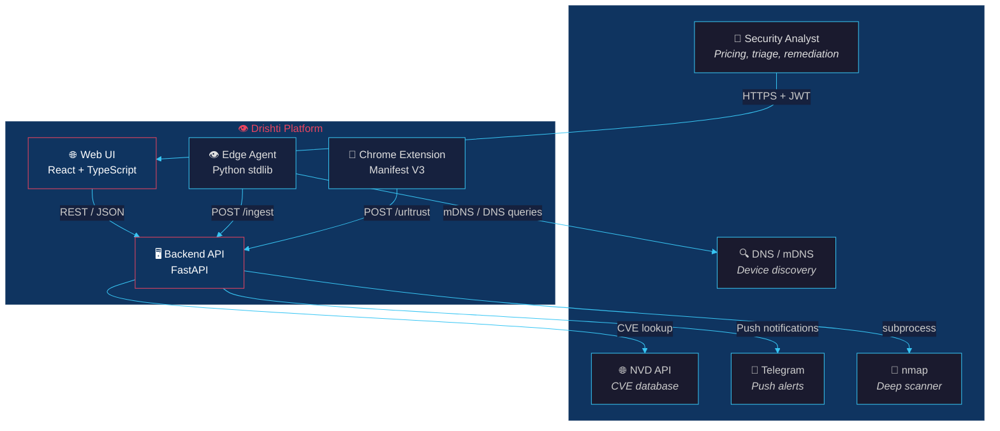

### C2 — Container Diagram

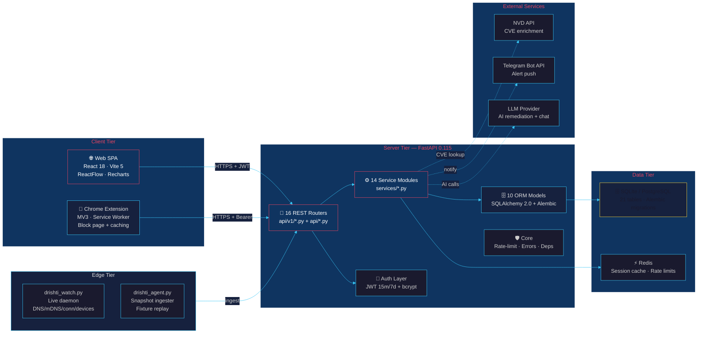

### C3 — Backend Service Layer

```mermaid
%%{init: {'theme': 'dark', 'themeVariables': { 'primaryColor': '#1a1a2e', 'primaryTextColor': '#e0e0e0', 'primaryBorderColor': '#38c6f4', 'lineColor': '#38c6f4', 'secondaryColor': '#16213e', 'tertiaryColor': '#0f3460', 'background': '#0a0a1a', 'mainBkg': '#1a1a2e', 'nodeBorder': '#38c6f4', 'clusterBkg': '#0f3460', 'titleColor': '#e94560', 'edgeLabelBackground': '#16213e'}}}%%
graph TB
 subgraph API_LAYER ["📡 API Routers (16 endpoints)"]
 HEALTH["health"]
 AUTH_R["auth"]
 ORG_R["org"]
 INGEST_R["ingest"]
 ASSETS_R["assets"]
 FINDINGS_R["findings"]
 GRAPH_R["graph"]
 PATHS_R["paths"]
 AI_R["ai"]
 DASH_R["dashboard"]
 REPORT_R["report"]
 LIVE_R["live"]
 NET_R["netconfig"]
 URL_R["urltrust"]
 SCAN_R["scan"]
 ADMIN_R["admin"]
 end

 subgraph SERVICE_LAYER ["⚙️ Service Layer"]
 RISK["risk_engine.py<br/>NetworkX DiGraph<br/>Node pricing"]
 ATK["attack_paths.py<br/>Yen's k-shortest<br/>Path enumeration"]
 IMPACT["impact.py<br/>Dollar scoring<br/>CVSS × blast radius"]
 RECOMP["recompute.py<br/>Exposure delta<br/>Live recompute"]
 INGEST_S["ingest.py<br/>Agent payload<br/>processing"]
 URLTRUST["urltrust/<br/>Heuristic + ML<br/>scoring"]
 DEEPSCAN["deepscan/<br/>nmap scanner<br/>CVE integration"]
 NETCONF["netconfig/<br/>Cisco config<br/>generation"]
 LIVE_S["live.py<br/>Watch orchestration"]
 INTEL["intel.py<br/>Threat feed<br/>integration"]
 AUTOSCAN["autoscan.py<br/>Scheduled scans"]
 HARD["hardening.py<br/>Ansible playbooks"]
 TG_ALERT["telegram_alerts.py<br/>Push notifications"]
 AI_SVC["ai/<br/>LLM chat + remediation"]
 ACCOUNTS["accounts.py<br/>User management"]
 DASH_SVC["dashboard_service.py<br/>Metrics aggregation"]
 end

 subgraph DATA_LAYER ["🗄️ Data Layer"]
 ORG_M["org.py"]
 ASSET_M["asset.py"]
 VULN_M["vuln.py"]
 FINDING_M["finding.py"]
 PATH_M["path.py"]
 SCAN_M["scan.py"]
 REM_M["remediation.py"]
 LIVE_M["live.py"]
 NET_M["netconfig.py"]
 URL_M["urltrust.py"]
 end

 API_LAYER --> SERVICE_LAYER
 SERVICE_LAYER --> DATA_LAYER

 style HEALTH fill:#16213e,stroke:#38c6f4,color:#e0e0e0
 style AUTH_R fill:#16213e,stroke:#38c6f4,color:#e0e0e0
 style RISK fill:#0f3460,stroke:#e94560,color:#fff
 style ATK fill:#0f3460,stroke:#e94560,color:#fff
 style AI_SVC fill:#16213e,stroke:#f4d03f,color:#1a1a2e
 style DEEPSCAN fill:#16213e,stroke:#f4d03f,color:#1a1a2e
```

---

## 🔄 Data Flow

### End-to-End: From Discovery to Remediation

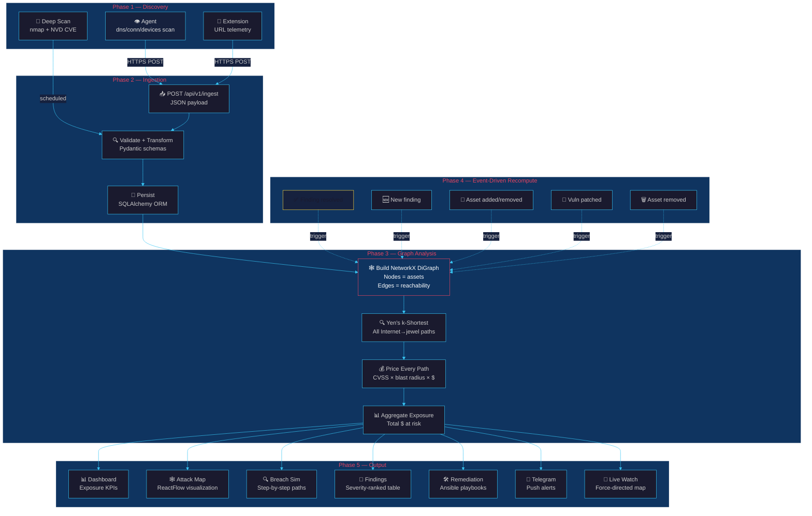

### Request Lifecycle: Auth → Data → Response

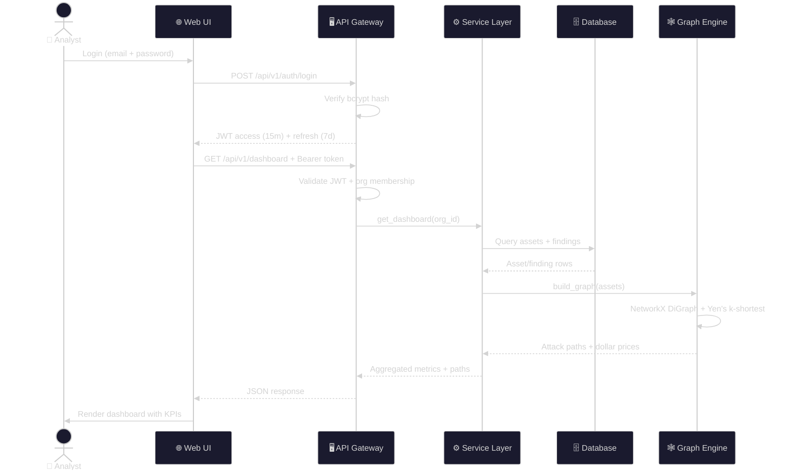

---

## ⚙️ Backend Deep Dive

### Backend Service Topology

```mermaid
%%{init: {'theme': 'dark', 'themeVariables': { 'primaryColor': '#1a1a2e', 'primaryTextColor': '#e0e0e0', 'primaryBorderColor': '#38c6f4', 'lineColor': '#38c6f4', 'secondaryColor': '#16213e', 'tertiaryColor': '#0f3460', 'background': '#0a0a1a', 'mainBkg': '#1a1a2e', 'nodeBorder': '#38c6f4', 'clusterBkg': '#0f3460', 'titleColor': '#e94560', 'edgeLabelBackground': '#16213e'}}}%%
graph TB
 subgraph SECURITY ["🔐 Security & Auth"]
 AUTH["auth.py<br/>JWT + bcrypt<br/>login/refresh/me"]
 DEPS["deps.py<br/>get_current_user<br/>rate limiting"]
 ERRORS["errors.py<br/>HTTPException handlers<br/>envelope format"]
 end

 subgraph BUSINESS ["⚙️ Business Logic — 14 Services"]
 RISK["risk_engine.py<br/>Graph construction<br/>Node pricing"]
 ATK["attack_paths.py<br/>Yen's k-shortest<br/>Path enumeration"]
 IMPACT["impact.py<break/>Dollar value<br/>CVSS × blast radius"]
 RECOMP["recompute.py<br/>Exposure recompute<br/>on events"]
 INGEST_S["ingest.py<br/>Agent payload<br/>normalization"]
 URLTRUST["urltrust/<br/>6-module scoring<br/>heuristic + ML"]
 DEEPSCAN["deepscan/<br/>nmap integration<br/>CVE lookup"]
 NETCONF["netconfig/<br/>Cisco config<br/>generation"]
 LIVE["live.py<br/>Device orchestration<br/>mDNS + DNS"]
 INTEL["intel.py<br/>Threat feeds<br/>enrichment"]
 AUTOSCAN["autoscan.py<br/>Scheduled scans<br/>APScheduler"]
 HARD["hardening.py<br/>Ansible<br/>playbooks"]
 TG["telegram_alerts.py<br/>Bot notifications"]
 AI["ai/<br/>LLM client +<br/>prompts + service"]
 ACC["accounts.py<br/>User + org<br/>management"]
 DASH["dashboard_service.py<br/>Metrics<br/>aggregation"]
 end

 subgraph SEED ["🌱 Demo Data"]
 ACME["acme.py<br/>Acme Retail<br/>network seed"]
 FIXTURES["fixtures/<br/>JSON scan<br/>data"]
 end

 SECURITY --> BUSINESS
 BUSINESS --> SEED

 style AUTH fill:#0f3460,stroke:#e94560,color:#fff
 style RISK fill:#0f3460,stroke:#e94560,color:#fff
 style ATK fill:#0f3460,stroke:#e94560,color:#fff
 style AI fill:#16213e,stroke:#f4d03f,color:#1a1a2e
 style DEEPSCAN fill:#16213e,stroke:#f4d03f,color:#1a1a2e
```

---

## 🕸️ Attack Graph Engine

The core of Drishti. Every asset becomes a node, every reachability relationship becomes a directed edge, and graph algorithms find what matters.

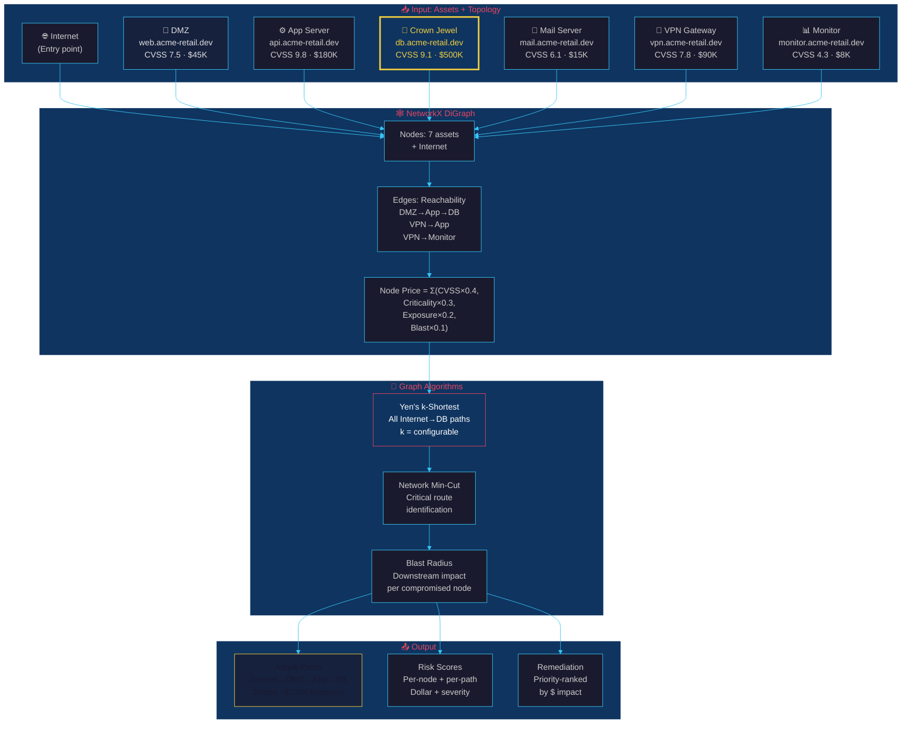

### Attack Path Enumeration

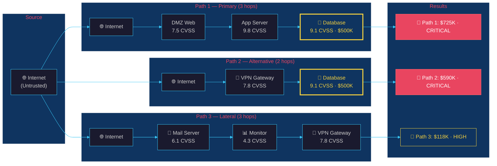

---

## 📊 Risk Scoring Model

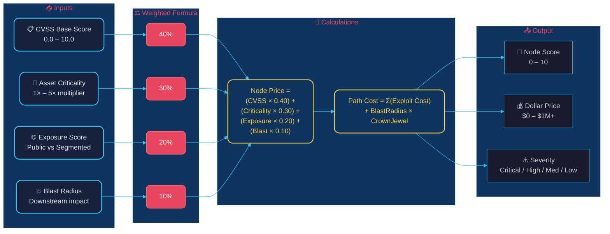

---

## 🔄 Recompute & Exposure Tracking

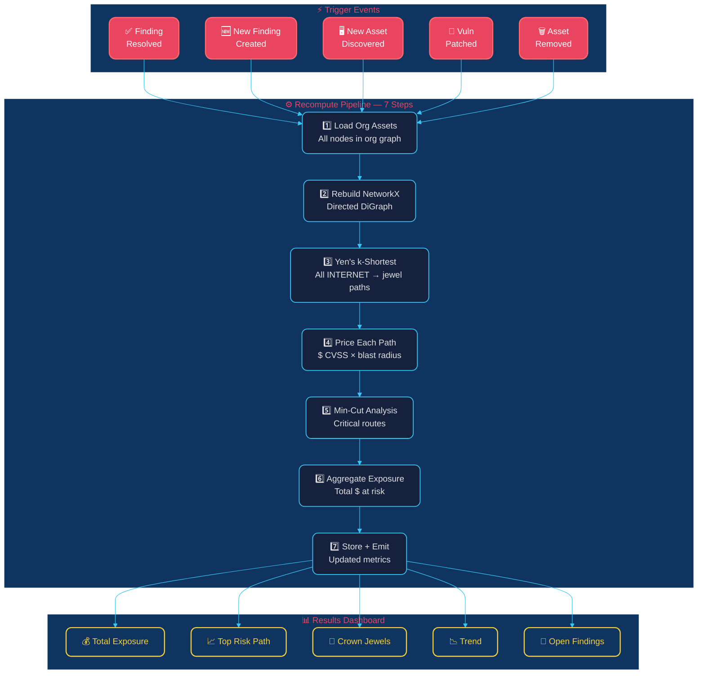

---

## 🔐 Authentication & Security

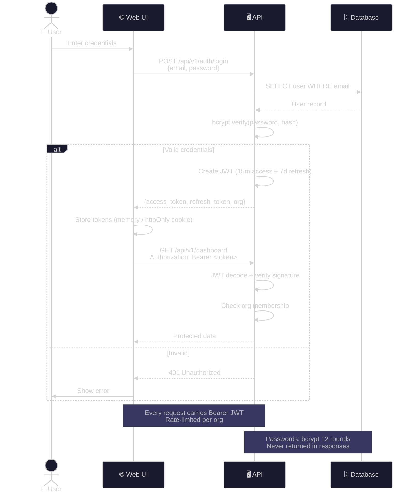

---

## 🚀 Deployment Architecture

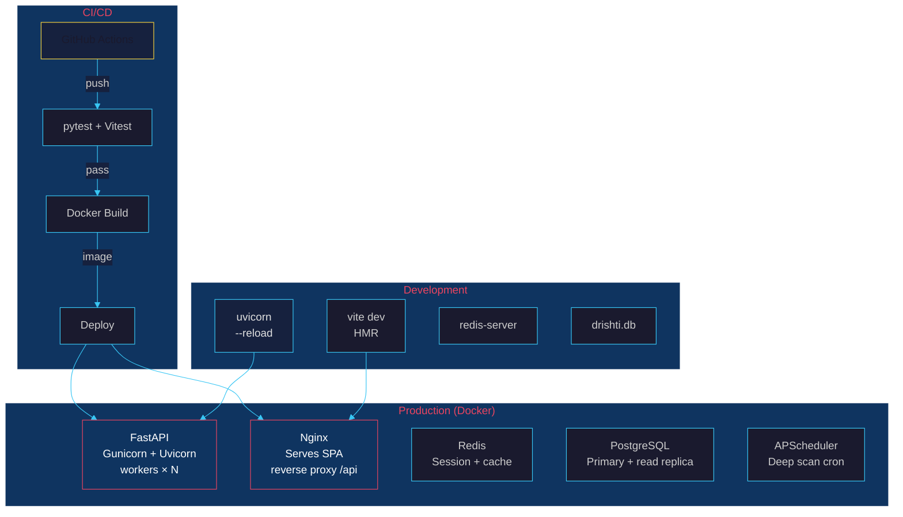

---

## ✨ Features

### Feature Map

```mermaid
%%{init: {'theme': 'dark', 'themeVariables': { 'primaryColor': '#1a1a2e', 'primaryTextColor': '#e0e0e0', 'primaryBorderColor': '#38c6f4', 'lineColor': '#38c6f4', 'secondaryColor': '#16213e', 'tertiaryColor': '#0f3460', 'background': '#0a0a1a', 'mainBkg': '#1a1a2e', 'nodeBorder': '#38c6f4', 'clusterBkg': '#0f3460', 'titleColor': '#e94560', 'edgeLabelBackground': '#16213e'}}}%%
graph TB
 subgraph VISUALIZE ["📊 Visualize"]
 DASH["📈 Dashboard<br/>KPI cards · exposure<br/>trends · severity split"]
 GRAPH_MAP["🕸️ Attack Map<br/>ReactFlow force graph<br/>blast radius coloring"]
 LIVE_MAP["📡 Live Watch<br/>Real-time topology<br/>mDNS discovery"]
 end

 subgraph ANALYZE ["🔬 Analyze"]
 BREACH["🔍 Breach Simulation<br/>Yen's paths<br/>step-by-step walkthrough"]
 FINDINGS_TBL["🚨 Findings<br/>Severity-ranked<br/>filterable · searchable"]
 URLTRUST_UI["🌐 URL Analyzer<br/>Reputation score<br/>WHOIS · heuristic · ML"]
 end

 subgraph ACT ["🛠️ Act"]
 REMED["🛠️ Remediation Studio<br/>3-column layout<br/>Ansible playbook gen"]
 AI_CHAT["💬 AI Assistant<br/>LLM-powered chat<br/>remediation advice"]
 REPORT_GEN["📋 Reports<br/>Full org export<br/>NetConfig download"]
 end

 subgraph DETECT ["👁️ Detect"]
 DEEP_SCAN["🔎 Deep Scan<br/>nmap autonomous<br/>NVD CVE lookup"]
 AUTO_SCAN["⏰ Auto Scan<br/>Scheduled triggers<br/>APScheduler"]
 THREAT_FEED["🌡️ Threat Intel<br/>Live feed integration<br/>enrichment"]
 end

 subgraph ALERT ["🔔 Alert"]
 TG_BOT["💬 Telegram<br/>Critical finding<br/>push alerts"]
 BLOCK_PAGE["🧩 Chrome Guard<br/>URL blocking<br/>warning page"]
 end

 subgraph MANAGE ["⚙️ Manage"]
 AUTH_MGMT["🔐 Auth<br/>JWT · org mgmt<br/>multi-tenant"]
 SETTINGS["⚙️ Settings<br/>Org config<br/>preferences"]
 end

 VISUALIZE --> ANALYZE --> ACT --> DETECT --> ALERT --> MANAGE

 style DASH fill:#16213e,stroke:#38c6f4,color:#e0e0e0
 style GRAPH_MAP fill:#0f3460,stroke:#e94560,color:#fff
 style BREACH fill:#0f3460,stroke:#e94560,color:#fff
 style REMED fill:#16213e,stroke:#f4d03f,color:#1a1a2e
 style DEEP_SCAN fill:#16213e,stroke:#f4d03f,color:#1a1a2e
 style TG_BOT fill:#16213e,stroke:#38c6f4,color:#e0e0e0
```

### Backend Architecture: Data Flow in Detail

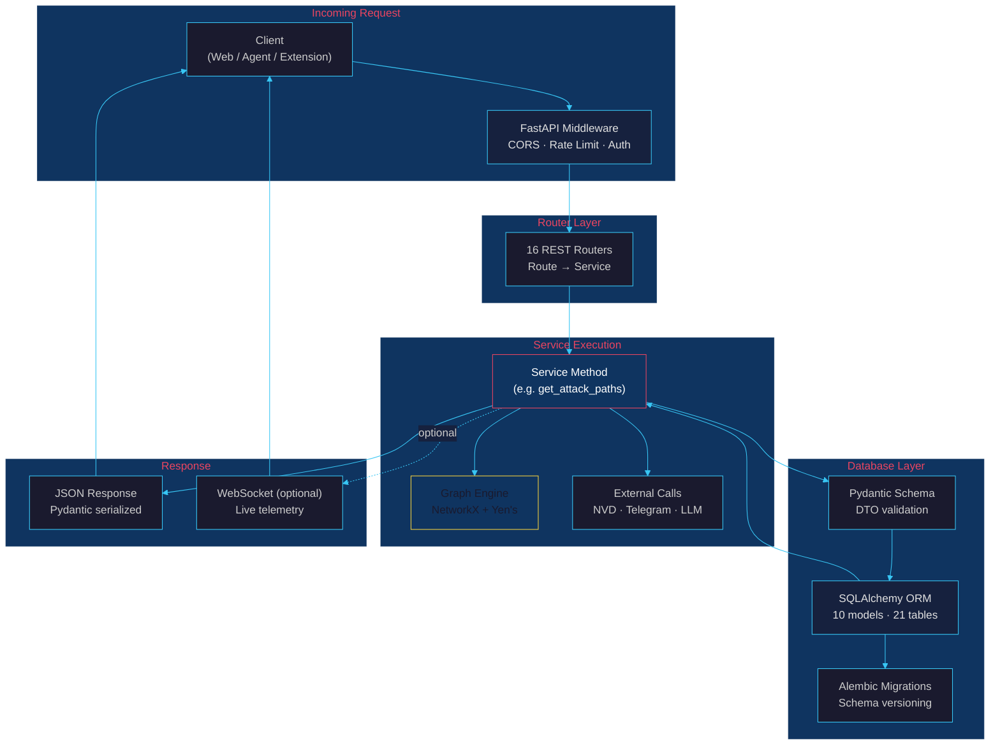

---

## 🚀 Quick Start

### Prerequisites

- **Python 3.11+** with `uv` or `pip`
- **Node.js 18+** with `npm`
- **Redis** (optional, for caching — falls back to memory)

### Backend

```bash
# 1. Clone and enter
git clone https://github.com/<org>/drishti.git && cd drishti

# 2. Start the server (auto-seeds demo org on first boot)
cd server
python -m venv .venv && source .venv/bin/activate
pip install -r requirements.txt
cp ../.env.example .env # adjust as needed
uvicorn app.main:app --host 0.0.0.0 --port 8000 --reload
```

Server running at **http://localhost:8000**

### Web Frontend

```bash
cd web
npm install
npm run dev
```

Web UI at **http://localhost:5173**

### Edge Agent

```bash
# Device discovery + live watch
python agent/drishti_watch.py --mode devices \
 --discover-wifi --server http://localhost:8000 \
 --token agent-demo-token

# One-shot fixture ingest (demo)
python agent/drishti_agent.py --once \
 --fixture server/app/seed/fixtures/db-prod-01.json \
 --server http://localhost:8000 \
 --token agent-demo-token
```

### Chrome Extension

1. `chrome://extensions` → toggle **Developer mode**
2. **Load unpacked** → select `extension/` folder
3. Open options → configure server URL → log in

**Demo credentials:** `analyst@acme-retail.dev` / `drishti-demo`

---

## 🛠️ Full Tech Stack

### Backend — Server

| Layer | Technology |
|---|---|
| **Framework** | FastAPI 0.115 |
| **ORM** | SQLAlchemy 2.0 + Alembic |
| **Auth** | python-jose (JWT 15m/7d) + bcrypt |
| **Graph Engine** | NetworkX 3.4 |
| **ML/Stats** | scikit-learn, numpy, scipy |
| **Scheduling** | APScheduler (deep scan) |
| **Monitoring** | prometheus-client, psutil |
| **Parsing** | beautifulsoup4, lxml, bleach |
| **CVE Data** | nvdlib (NVD API) |
| **Feeds** | feedparser, dnspython |

### Frontend — Web

| Layer | Technology |
|---|---|
| **Framework** | React 18.3 + TypeScript |
| **Build** | Vite 5 + Code Splitting |
| **Styling** | Tailwind CSS 3.4 |
| **State** | Zustand 4.5 (client) + TanStack Query 5.51 (server) |
| **Graph** | ReactFlow 11.11 (attack map) |
| **Charts** | Recharts 2.12 |
| **Animation** | Framer Motion 12.42 |
| **Icons** | Lucide React |
| **Testing** | Vitest + Testing Library |

### Edge — Agent + Extension

| Component | Stack |
|---|---|
| **Edge Agent** | Python stdlib-only (zero external deps) |
| **Chrome Extension** | Manifest V3, service worker, chrome.storage |

---

## 📁 Repository Map

```
drishti/
├── 📄 README.md ← you are here
├── ⚙️ .env.example # Environment template
├── 📦 package.json # Root (legacy web frontend)
│
├── 🖥️ server/ # FastAPI Backend
│ ├── 🐍 run.py # uvicorn entrypoint
│ ├── 📋 requirements.txt # Python deps
│ ├── 📋 pyproject.toml # Build config (hatchling)
│ ├── 🗄️ drishti.db # SQLite (dev)
│ │
│ └── 📁 app/
│ ├── 🚀 main.py # App assembly · lifespan · middleware
│ ├── ⚙️ config.py # Env-driven settings (pydantic-settings)
│ ├── 🗄️ db.py # SQLAlchemy engine + session factory
│ ├── 🔧 db_init.py # Schema column reconciliation
│ │
│ ├── 📁 api/ # 16 REST Routers
│ │ ├── health.py # Health check
│ │ ├── auth.py # JWT login / refresh / me
│ │ ├── org.py # Organization CRUD
│ │ ├── ingest.py # Agent data ingestion
│ │ ├── assets.py # Asset management
│ │ ├── findings.py # Vulnerability findings
│ │ ├── graph.py # Network graph data
│ │ ├── paths.py # Attack path computation
│ │ ├── ai.py # LLM chat + analysis
│ │ ├── dashboard.py # Exposure metrics
│ │ ├── report.py # Full org report
│ │ ├── live.py # Real-time telemetry
│ │ ├── netconfig.py # Network config export
│ │ ├── urltrust.py # URL reputation
│ │ ├── scan.py # Deep scan triggers
│ │ └── v1/ # v1 API namespace (14 routers)
│ │
│ ├── 📁 models/ # 10 SQLAlchemy ORM Models
│ │ ├── org.py # Organization + membership
│ │ ├── asset.py # Network assets
│ │ ├── vuln.py # Vulnerabilities
│ │ ├── finding.py # Risk findings
│ │ ├── path.py # Attack paths
│ │ ├── scan.py # Scan sessions
│ │ ├── remediation.py # Remediation actions
│ │ ├── live.py # Live device data
│ │ ├── netconfig.py # Network config
│ │ └── urltrust.py # URL trust entries
│ │
│ ├── 📁 schemas/ # Pydantic DTOs (12 schemas)
│ ├── 📁 services/ # 14 Business-Logic Modules
│ │ ├── risk_engine.py # NetworkX graph engine
│ │ ├── attack_paths.py # Yen's k-shortest paths
│ │ ├── impact.py # $ pricing model
│ │ ├── recompute.py # Live exposure delta
│ │ ├── ingest.py # Agent payload processing
│ │ ├── urltrust/ # URL scoring (heuristic + ML)
│ │ │ ├── analyzer.py
│ │ │ ├── checks.py
│ │ │ ├── scoring.py
│ │ │ ├── providers.py
│ │ │ ├── network.py
│ │ │ └── summary.py
│ │ ├── deepscan/ # Autonomous nmap scanner
│ │ │ ├── scanner.py
│ │ │ ├── parser.py
│ │ │ ├── cve_lookup.py
│ │ │ └── integration.py
│ │ ├── netconfig/ # Network config generation
│ │ │ ├── detectors.py
│ │ │ ├── facts.py
│ │ │ └── service.py
│ │ ├── live.py # Live watch orchestration
│ │ ├── live_threats.py # Threat feed integration
│ │ ├── autoscan.py # Scheduled deep-scan triggers
│ │ ├── hardening.py # Ansible playbook generation
│ │ ├── telegram_alerts.py # Telegram push notifications
│ │ └── ai/ # LLM integration
│ │ ├── client.py
│ │ ├── service.py
│ │ ├── prompts.py
│ │ └── ai_remediate.py
│ │
│ ├── 📁 core/ # Core Infrastructure
│ │ ├── security.py # JWT + bcrypt helpers
│ │ ├── deps.py # Auth/rate-limit dependencies
│ │ └── errors.py # Error envelope + handlers
│ │
│ ├── 📁 seed/ # Demo Data
│ │ ├── acme.py # Acme Retail demo network
│ │ └── fixtures/ # JSON scan fixtures
│ │
│ └── 📁 scripts/ # Maintenance utilities
│
├── 🌐 web/ # React SPA (Vite + TypeScript)
│ ├── src/
│ │ ├── App.tsx # Root router + providers
│ │ ├── 📁 features/ # 12 Feature Modules
│ │ │ ├── landing/ # Marketing hero page
│ │ │ ├── auth/ # Login + Signup
│ │ │ ├── dashboard/ # Exposure overview + KPIs
│ │ │ ├── graph/ # 🕸️ Attack Map (ReactFlow)
│ │ │ ├── paths/ # 🔍 Breach Simulation
│ │ │ ├── findings/ # 🚨 Severity-ranked table
│ │ │ ├── remediation/ # 🛠️ 3-Column Ansible Studio
│ │ │ ├── live/ # 📡 Force-directed live map
│ │ │ ├── report/ # 📋 Reports + NetConfig
│ │ │ ├── settings/ # ⚙️ Org settings
│ │ │ └── urltrust/ # 🌐 URL Analyzer UI
│ │ ├── 📁 api/ # TypeScript API clients
│ │ ├── 📁 store/ # Zustand state stores
│ │ ├── 📁 components/ # Shared UI components
│ │ ├── 📁 lib/ # Utilities + helpers
│ │ └── 📁 styles/ # Tailwind + global CSS
│ │
│ ├── package.json
│ ├── vite.config.ts
│ └── Dockerfile
│
├── 👁️ agent/ # Edge Agent (stdlib-only Python)
│ ├── drishti_watch.py # Live watch daemon
│ │ # (DNS/history/conn/devices modes)
│ └── drishti_agent.py # Snapshot ingester
│ # (Fixture replay + POST to /api/ingest)
│
├── 🧩 extension/ # Chrome Web Guard (MV3)
│ ├── manifest.json # MV3 manifest (minimal permissions)
│ ├── background.js # Service worker (nav gate + cache)
│ ├── options.html / .js # Server URL + login UI
│ ├── warning.html / .js / .css # Block page (redirect target)
│ └── README.md # Extension docs + demo script
│
└── 📚 Drishti Docs/ # Full Documentation Suite
 ├── PRD.md # Product Requirements
 ├── TRD.md # Technical Requirements + Formulas
 ├── ARCHITECTURE.md # C4 Diagrams + Design Decisions
 ├── APP_FLOW.md # Sequence Diagrams (All Journeys)
 ├── DATA_MODEL.md # ER Diagram + 21-Table Dictionary
 ├── API_REFERENCE.md # Every Endpoint Documented
 ├── SECURITY_MODEL.md # Defensive-Only Stance + Auth
 └── UIUX.md # Design System Specification
```

---

## 🧪 Testing

```bash
# ── Backend (232+ tests) ──
cd server
source .venv/bin/activate
pytest --tb=short -v

# ── Frontend ──
cd web
npm test

# ── Live Watch ──
python agent/drishti_watch.py --once \
 --fixture server/app/seed/fixtures/db-prod-01.json \
 --server http://localhost:8000 \
 --token agent-demo-token
```

| Test Suite | Coverage |
|---|---|
| `test_scoring.py` | Risk scoring + pricing model |
| `test_paths.py` | Attack path enumeration (Yen's) |
| `test_blast_radius.py` | Blast radius computation |
| `test_impact.py` | Dollar impact calculations |
| `test_recompute.py` | Exposure recompute pipeline |
| `test_deepscan.py` | nmap scan integration |
| `test_autoscan.py` | Scheduled scan triggers |
| `test_live.py` | Live telemetry API |
| `test_live_devices.py` | Device discovery |
| `test_agent_discovery.py` | Agent topology discovery |
| `test_agent.py` | Agent ingestion |
| `test_ingest.py` | Payload processing |
| `test_urltrust.py` | URL trust scoring |
| `test_urltrust_network.py` | URL network analysis |
| `test_auth_security.py` | JWT + bcrypt + rate limit |
| `test_accounts.py` | User + org management |
| `test_assets.py` | Asset CRUD |
| `test_contracts.py` | API contract tests |
| `test_report.py` | Report generation |
| `test_netconfig.py` | Network config export |
| `test_ai.py` | LLM integration |
| `test_config.py` | Config validation |
| `test_deps.py` | Dependency injection |
| `test_db_init.py` | Database migration |
| `test_main.py` | App startup |
| `test_live_threats.py` | Threat feed integration |
| `test_read_service.py` | Read service layer |

---

## 📊 Demo Network — Acme Retail

| Asset | Type | CVSS | Dollar Value | Status |
|---|---|---|---|---|
| `web.acme-retail.dev` | DMZ Web Server | 7.5 | **$45,000** | 🟢 Online |
| `api.acme-retail.dev` | App Server | 9.8 | **$180,000** | 🟢 Online |
| `db.acme-retail.dev` | Database (Crown Jewel) | 9.1 | **$500,000** | 🟢 Online |
| `mail.acme-retail.dev` | Mail Server | 6.1 | **$15,000** | 🟡 Degraded |
| `vpn.acme-retail.dev` | VPN Gateway | 7.8 | **$90,000** | 🟢 Online |
| `monitor.acme-retail.dev` | Monitoring | 4.3 | **$8,000** | 🟢 Online |
| **Total Exposure** | | | **$902,900** | |

Login: `analyst@acme-retail.dev` / `drishti-demo`

---

## 📚 Documentation

| Document | Description |
|---|---|
| [PRD.md](Drishti%20Docs/PRD.md) | Product Requirements — problem, personas, goals |
| [TRD.md](Drishti%20Docs/TRD.md) | Technical Requirements — stack, formulas, service specs |
| [ARCHITECTURE.md](Drishti%20Docs/ARCHITECTURE.md) | C4 diagrams, design decisions, repo map |
| [APP_FLOW.md](Drishti%20Docs/APP_FLOW.md) | Sequence diagrams for all user journeys |
| [DATA_MODEL.md](Drishti%20Docs/DATA_MODEL.md) | ER diagram, 21-table dictionary |
| [API_REFERENCE.md](Drishti%20Docs/API_REFERENCE.md) | Every endpoint (method, auth, request/response) |
| [SECURITY_MODEL.md](Drishti%20Docs/SECURITY_MODEL.md) | Defensive-only stance, consent gating, auth internals |
| [UIUX.md](Drishti%20Docs/UIUX.md) | Design system specification |

---

## 🤝 Contributing

1. Fork → `git checkout -b feat/amazing-feature`
2. Commit → `git commit -m 'feat: add amazing feature'`
3. Push → `git push origin feat/amazing-feature`
4. Open PR — all 232+ backend tests + frontend Vitest must pass

---

<div align="center">

**Drishti** &nbsp;👁️&nbsp; See the invisible. Price the risk. Fix it first.

*Defensive only. Maps, prices, and remediates. Never attacks.*

</div>
