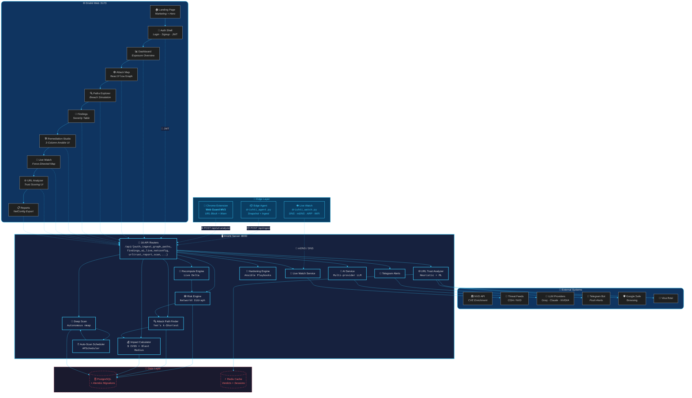
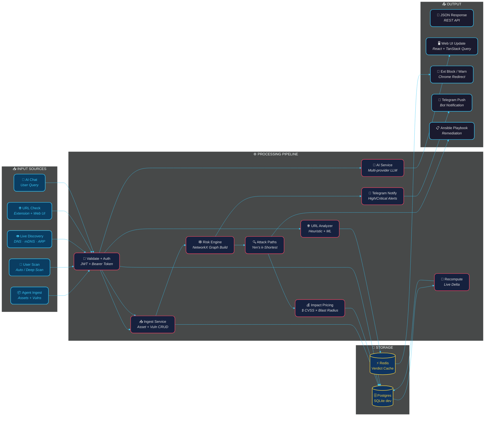
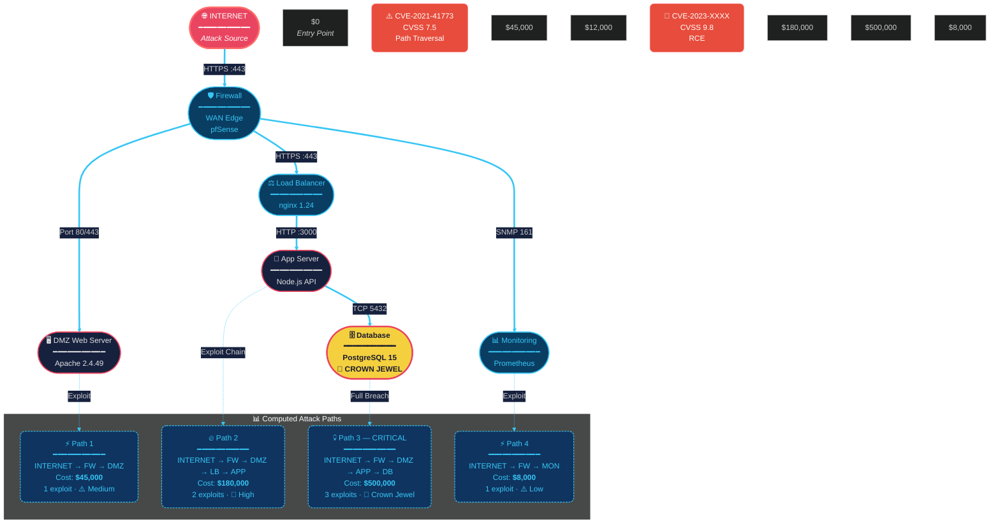
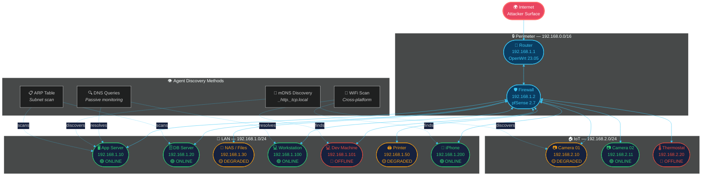
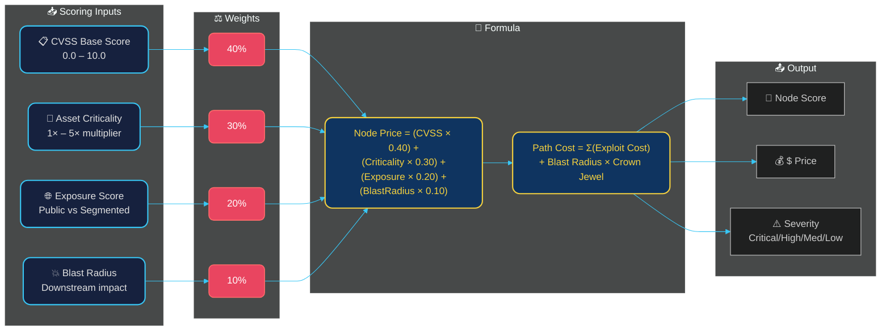

<!-- Hero Section -->
<div align="center">

# <span style="font-size:48px;">👁️</span> Drishti


*AI-powered attack-path intelligence platform.* Maps how an attacker reads your network, traces every route from the internet to crown-jewel assets, prices each path in **dollars**, and drafts human-reviewed Ansible fixes. Never attacks.

---

### Tech Stack

[](https://www.python.org/) &nbsp;
[](https://fastapi.tiangolo.com/) &nbsp;
[](https://www.sqlalchemy.org/) &nbsp;
[](https://networkx.org/) &nbsp;
[](https://react.dev/) &nbsp;
[](https://www.typescriptlang.org/) &nbsp;
[](https://tailwindcss.com/) &nbsp;
[](https://reactflow.dev/) &nbsp;
[](https://docs.pmnd.rs/zustand) &nbsp;
[](https://tanstack.com/query) &nbsp;
[](https://vitest.dev/) &nbsp;
[](https://pytest.org/)

</div>

---

## ✨ Core Capabilities

<div align="center">

| | | | |
|---|---|---|---|
| 🕸️ **Risk Engine** | 💰 **Dollar Pricing** | 🛠️ **Remediation Studio** | 📡 **Live Watch** |
| NetworkX directed graph with Yen's k-shortest paths. Computes every INTERNET → asset attack route. | Every path and node priced in $ using CVSS-weighted blast-radius model. | 3-column studio drafting Ansible playbooks — human reviewed, never auto-deployed. | Real-time LAN device discovery via DNS, mDNS, ARP with live telemetry streaming. |
| | | | |
| 🔍 **Deep Scan** | 🌐 **URL Trust** | 🤖 **AI Assistant** | 🔔 **Telegram Alerts** |
| Autonomous nmap deep-scan scheduler with trigger-based execution. | Heuristic + ML URL reputation scoring — blocks high-risk navigation. | Multi-provider LLM (Groq Llama 3.3 / Claude / NVIDIA) with mock mode. | Real-time push notifications for high/critical findings. |
| | | | |
| 🔌 **Chrome Extension** | 📊 **Findings Dashboard** | 📋 **Reports + NetConfig** | 🔄 **Live Recompute** |
| "Web Guard" MV3 browser extension for real-time URL warning/blocking. | Severity-ranked vulnerability table with CVE enrichment from NVD. | Auto-generated network config export and full org security reports. | Resolve a finding → total org exposure recomputes instantly. |

</div>

> 💡 **Live demo:** On the seeded Acme Retail network, resolving a critical finding drops total exposure from **$902,900 → $702,900** — verified by the test suite.

---

## 🏗️ System Architecture



---

## 🔗 Data Flow — End to End



---

## ⚔️ Risk Engine — Attack Path Graph



---

## 🌐 Network Topology — Live Watch



---

## 🔐 Authentication & Security Flow

```mermaid
%%{init: {'theme': 'dark', 'themeVariables': { 'primaryColor': '#1a1a2e', 'edgeLabelBackground':'#16213e', 'tertiaryColor': '#0f3460', 'primaryTextColor': '#e0e0e0', 'lineColor': '#38c6f4', 'secondaryColor': '#1a1a2e', 'tertiaryColor': '#0f3460'}}}%%
sequenceDiagram
 actor U as 👤 User
 actor EXT as 🧩 Extension
 participant UI as 🌐 Web UI
 participant API as 🖥️ FastAPI Server
 participant DB as 🗄️ Database
 participant CACHE as ⚡ Redis Cache
 participant LLM as 🧠 LLM Provider
 participant TG as 💬 Telegram Bot

 %% ── Login Flow ──
 rect rgb(15, 52, 96)
 Note over U,API: 🔐 AUTHENTICATION
 U->>UI: Enter email + password
 UI->>API: POST /api/auth/login<br/>{email, password}
 API->>DB: bcrypt verify + lookup
 DB-->>API: User record + org
 API->>API: Create JWT<br/>(access: 15m, refresh: 7d)
 API-->>UI: {access_token, refresh_token}
 UI->>UI: Store tokens<br/>(memory + localStorage)
 end

 %% ── API Call Flow ──
 rect rgb(26, 26, 46)
 Note over UI,DB: 📡 API REQUEST / RESPONSE
 U->>UI: Navigate to Dashboard
 UI->>API: GET /api/dashboard<br/>Authorization: Bearer {token}
 API->>API: Validate JWT<br/>(python-jose)
 API->>API: Rate limit check
 API->>DB: Query org-scoped data
 DB-->>API: Exposure metrics
 API-->>UI: JSON response
 UI->>UI: TanStack Query cache update
 end

 %% ── Token Refresh ──
 rect rgb(10, 61, 98)
 Note over UI,API: 🔄 TOKEN REFRESH
 UI->>API: GET /api/findings (401)
 UI->>API: POST /api/auth/refresh
 API->>API: Validate refresh token
 API-->>UI: {access_token: new}
 UI->>API: Retry GET /api/findings<br/>with new token
 API-->>UI: {findings: [...]}
 end

 %% ── AI Chat Flow ──
 rect rgb(15, 52, 96)
 Note over UI,LLM: 🤖 AI ASSISTANT
 U->>UI: "Explain finding #12"
 UI->>API: POST /api/ai/chat<br/>Bearer {token}
 API->>API: Auth + rate limit
 API->>LLM: Stream completion<br/>(Groq Llama 3.3 / Claude)
 LLM-->>API: Streamed tokens
 API-->>UI: {response: "..."}
 end

 %% ── Extension Flow ──
 rect rgb(10, 61, 98)
 Note over EXT,API: 🧩 EXTENSION AUTH
 EXT->>API: POST /api/auth/login<br/>(from options page)
 API-->>EXT: {access_token}
 EXT->>EXT: chrome.storage.local.set
 end

 %% ── URL Analysis Flow ──
 rect rgb(26, 26, 46)
 Note over EXT,EXT: 🌐 URL ANALYSIS (Extension)
 EXT->>EXT: chrome.webNavigation<br/>onBeforeNavigate fires
 EXT->>EXT: Check allowlist + cache
 EXT->>API: POST /api/url-analyzer/analyze<br/>Bearer {token}
 API->>CACHE: Check verdict cache (TTL 10m)
 alt Cache Hit
 CACHE-->>API: {band, score, reasons}
 else Cache Miss
 API->>API: Heuristic + ML scoring
 API->>CACHE: Store result (TTL 10m)
 end
 API-->>EXT: {band: "High Risk"}
 alt band == "High Risk"
 EXT->>EXT: 🔴 Redirect → warning.html
 else band == "Caution"
 EXT->>EXT: 🟡 Amber badge
 else band == "Trusted"
 EXT->>EXT: 🟢 Teal badge → continue
 end
 end

 %% ── Alert Flow ──
 rect rgb(233, 69, 96)
 Note over API,TG: 🔔 TELEGRAM ALERTS
 API->>API: Scan for high/critical findings
 API->>TG: Send notification
 TG-->>U: 📱 "Critical: CVE-2023-XXXX on app server"
 end
```



---

## 🔄 Recompute & Exposure Tracking

```mermaid
%%{init: {'theme': 'dark', 'themeVariables': { 'primaryColor': '#1a1a2e', 'edgeLabelBackground':'#16213e', 'tertiaryColor': '#0f3460', 'primaryTextColor': '#e0e0e0', 'lineColor': '#38c6f4', 'secondaryColor': '#1a1a2e', 'tertiaryColor': '#0f3460'}}}%%
flowchart TD
 classDef trigger fill:#e94560,stroke:#ff6b6b,stroke-width:2px,color:#fff,rx:12
 classDef step fill:#16213e,stroke:#38c6f4,stroke-width:1.5px,color:#e0e0e0,rx:10
 classDef result fill:#0f3460,stroke:#f4d03f,stroke-width:2px,color:#f4d03f,rx:10

 subgraph TRIGGERS [⚡ Trigger Events]
 direction LR
 T1["✅ Finding<br/>Resolved"]:::trigger
 T2["🆕 New Finding<br/>Created"]:::trigger
 T3["🖥️ New Asset<br/>Discovered"]:::trigger
 T4["🔧 Vuln<br/>Patched"]:::trigger
 T5["🗑️ Asset<br/>Removed"]:::trigger
 end

 subgraph PIPELINE [⚙️ Recompute Pipeline — 7 Steps]
 direction TB
 S1["1️⃣ Load Org Assets<br/><i>All nodes in org graph</i>"]:::step
 S2["2️⃣ Rebuild NetworkX<br/><i>Directed DiGraph</i>"]:::step
 S3["3️⃣ Yen's k-Shortest<br/><i>All INTERNET → jewel paths</i>"]:::step
 S4["4️⃣ Price Each Path<br/><i>$ CVSS × blast radius</i>"]:::step
 S5["5️⃣ Min-Cut Analysis<br/><i>Critical routes</i>"]:::step
 S6["6️⃣ Aggregate Exposure<br/><i>Total $ at risk</i>"]:::step
 S7["7️⃣ Store + Emit<br/><i>Updated metrics</i>"]:::step
 end

 subgraph RESULTS [📊 Results Dashboard]
 direction LR
 R1["💰 Total Exposure<br/><b>$702,900</b>"]:::result
 R2["📈 Top Risk Path<br/><b>3 hops</b>"]:::result
 R3("👑 Crown Jewels<br/><b>2 flagged</b>"):::result
 R4["📉 Trend<br/><b>↓ 22%</b>"):::result
 R5["🚨 Open Findings<br/><b>23</b>"):::result
 end

 T1 & T2 & T3 & T4 & T5 --> S1
 S1 --> S2 --> S3 --> S4 --> S5 --> S6 --> S7
 S7 --> R1 & R2 & R3 & R4 & R5
```

---

## 🔬 Risk Scoring Model



---

## 🚀 Quick Start

### Prerequisites

- **Python 3.11+** with `uv` or `pip`
- **Node.js 18+** with `npm`
- **Redis** (optional, for caching — falls back to memory)

### Backend

```bash
# 1. Clone and enter
git clone https://github.com/<org>/drishti.git && cd drishti

# 2. Start the server (auto-seeds demo org on first boot)
cd server
python -m venv .venv && source .venv/bin/activate
pip install -r requirements.txt
cp ../.env.example .env # adjust as needed
uvicorn app.main:app --host 0.0.0.0 --port 8000 --reload
```

Server running at **http://localhost:8000**

### Web Frontend

```bash
cd web
npm install
npm run dev
```

Web UI at **http://localhost:5173**

### Edge Agent

```bash
# Device discovery + live watch
python agent/drishti_watch.py --mode devices \
 --discover-wifi --server http://localhost:8000 \
 --token agent-demo-token

# One-shot fixture ingest (demo)
python agent/drishti_agent.py --once \
 --fixture server/app/seed/fixtures/db-prod-01.json \
 --server http://localhost:8000 \
 --token agent-demo-token
```

### Chrome Extension

1. `chrome://extensions` → toggle **Developer mode**
2. **Load unpacked** → select `extension/` folder
3. Open options → configure server URL → log in

**Demo credentials:** `analyst@acme-retail.dev` / `drishti-demo`

---

## 🛠️ Full Tech Stack

### Backend — Server

| Layer | Technology |
|---|---|
| **Framework** | FastAPI 0.115 |
| **ORM** | SQLAlchemy 2.0 + Alembic |
| **Auth** | python-jose (JWT 15m/7d) + bcrypt |
| **Graph Engine** | NetworkX 3.4 |
| **ML/Stats** | scikit-learn, numpy, scipy |
| **Scheduling** | APScheduler (deep scan) |
| **Monitoring** | prometheus-client, psutil |
| **Parsing** | beautifulsoup4, lxml, bleach |
| **CVE Data** | nvdlib (NVD API) |
| **Feeds** | feedparser, dnspython |

### Frontend — Web

| Layer | Technology |
|---|---|
| **Framework** | React 18.3 + TypeScript |
| **Build** | Vite 5 + Code Splitting |
| **Styling** | Tailwind CSS 3.4 |
| **State** | Zustand 4.5 (client) + TanStack Query 5.51 (server) |
| **Graph** | ReactFlow 11.11 (attack map) |
| **Charts** | Recharts 2.12 |
| **Animation** | Framer Motion 12.42 |
| **Icons** | Lucide React |
| **Testing** | Vitest + Testing Library |

### Edge — Agent + Extension

| Component | Stack |
|---|---|
| **Edge Agent** | Python stdlib-only (zero external deps) |
| **Chrome Extension** | Manifest V3, service worker, chrome.storage |

---

## 📁 Repository Map

```
drishti/
├── 📄 README.md ← you are here
├── ⚙️ .env.example # Environment template
├── 📦 package.json # Root (legacy web frontend)
│
├── 🖥️ server/ # FastAPI Backend
│ ├── 🐍 run.py # uvicorn entrypoint
│ ├── 📋 requirements.txt # Python deps
│ ├── 📋 pyproject.toml # Build config (hatchling)
│ ├── 🗄️ drishti.db # SQLite (dev)
│ │
│ └── 📁 app/
│ ├── 🚀 main.py # App assembly · lifespan · middleware
│ ├── ⚙️ config.py # Env-driven settings (pydantic-settings)
│ ├── 🗄️ db.py # SQLAlchemy engine + session factory
│ ├── 🔧 db_init.py # Schema column reconciliation
│ │
│ ├── 📁 api/v1/ # 16 REST Routers
│ │ ├── health.py # Health check
│ │ ├── auth.py # JWT login / refresh / me
│ │ ├── org.py # Organization CRUD
│ │ ├── ingest.py # Agent data ingestion
│ │ ├── assets.py # Asset management
│ │ ├── findings.py # Vulnerability findings
│ │ ├── graph.py # Network graph data
│ │ ├── paths.py # Attack path computation
│ │ ├── ai.py # LLM chat + analysis
│ │ ├── dashboard.py # Exposure metrics
│ │ ├── report.py # Full org report
│ │ ├── live.py # Real-time telemetry
│ │ ├── netconfig.py # Network config export
│ │ ├── urltrust.py # URL reputation
│ │ └── scan.py # Deep scan triggers
│ │
│ ├── 📁 models/ # 10 SQLAlchemy ORM Models
│ │ ├── org.py # Organization + membership
│ │ ├── asset.py # Network assets
│ │ ├── vuln.py # Vulnerabilities
│ │ ├── finding.py # Risk findings
│ │ ├── path.py # Attack paths
│ │ ├── scan.py # Scan sessions
│ │ ├── remediation.py # Remediation actions
│ │ ├── live.py # Live device data
│ │ ├── netconfig.py # Network config
│ │ └── urltrust.py # URL trust entries
│ │
│ ├── 📁 schemas/ # Pydantic DTOs
│ ├── 📁 services/ # 9 Business-Logic Modules
│ │ ├── risk_engine.py # NetworkX graph engine
│ │ ├── attack_paths.py # Yen's k-shortest paths
│ │ ├── impact.py # $ pricing model
│ │ ├── recompute.py # Live exposure delta
│ │ ├── ingest.py # Agent payload processing
│ │ ├── urltrust/ # URL scoring (heuristic + ML)
│ │ ├── deepscan/ # Autonomous nmap scanner
│ │ ├── netconfig/ # Network config generation
│ │ ├── live.py # Live watch orchestration
│ │ ├── live_threats.py # Threat feed integration
│ │ ├── autoscan.py # Scheduled deep-scan triggers
│ │ ├── hardening.py # Ansible playbook generation
│ │ └── telegram_alerts.py # Telegram push notifications
│ │
│ ├── 📁 core/ # Core Infrastructure
│ │ ├── security.py # JWT + bcrypt helpers
│ │ ├── deps.py # Auth/rate-limit dependencies
│ │ └── errors.py # Error envelope + handlers
│ │
│ ├── 📁 seed/ # Demo Data
│ │ ├── acme.py # Acme Retail demo network
│ │ └── fixtures/ # JSON scan fixtures
│ │
│ └── 📁 scripts/ # Maintenance utilities
│
├── 🌐 web/ # React SPA (Vite + TypeScript)
│ ├── src/
│ │ ├── App.tsx # Root router + providers
│ │ ├── 📁 features/ # 12 Feature Modules
│ │ │ ├── landing/ # Marketing hero page
│ │ │ ├── auth/ # Login + Signup
│ │ │ ├── dashboard/ # Exposure overview + KPIs
│ │ │ ├── graph/ # 🕸️ Attack Map (ReactFlow)
│ │ │ ├── paths/ # 🔍 Breach Simulation
│ │ │ ├── findings/ # 🚨 Severity-ranked table
│ │ │ ├── remediation/ # 🛠️ 3-Column Ansible Studio
│ │ │ ├── live/ # 📡 Force-directed live map
│ │ │ ├── report/ # 📋 Reports + NetConfig
│ │ │ ├── settings/ # ⚙️ Org settings
│ │ │ └── urltrust/ # 🌐 URL Analyzer UI
│ │ ├── 📁 api/ # TypeScript API clients
│ │ ├── 📁 store/ # Zustand state stores
│ │ ├── 📁 components/ # Shared UI components
│ │ ├── 📁 lib/ # Utilities + helpers
│ │ └── 📁 styles/ # Tailwind + global CSS
│ ├── package.json
│ ├── vite.config.ts
│ └── Dockerfile
│
├── 👁️ agent/ # Edge Agent (stdlib-only Python)
│ ├── drishti_watch.py # Live watch daemon
│ │ # (DNS/history/conn/devices modes)
│ └── drishti_agent.py # Snapshot ingester
│ # (Fixture replay + POST to /api/ingest)
│
├── 🧩 extension/ # Chrome Web Guard (MV3)
│ ├── manifest.json # MV3 manifest (minimal permissions)
│ ├── background.js # Service worker (nav gate + cache)
│ ├── options.html / .js # Server URL + login UI
│ ├── warning.html / .js / .css # Block page (redirect target)
│ └── README.md # Extension docs + demo script
│
└── 📚 Drishti Docs/ # Full Documentation Suite
 ├── PRD.md # Product Requirements
 ├── TRD.md # Technical Requirements + Formulas
 ├── ARCHITECTURE.md # C4 Diagrams + Design Decisions
 ├── APP_FLOW.md # Sequence Diagrams (All Journeys)
 ├── DATA_MODEL.md # ER Diagram + 21-Table Dictionary
 ├── API_REFERENCE.md # Every Endpoint Documented
 ├── SECURITY_MODEL.md # Defensive-Only Stance + Auth
 └── UIUX.md # Design System Specification
```

---

## 🧪 Testing

```bash
# ── Backend (232+ tests) ──
cd server
source .venv/bin/activate
pytest --tb=short -v

# ── Frontend ──
cd web
npm test

# ── Live Watch ──
python agent/drishti_watch.py --once \
 --fixture server/app/seed/fixtures/db-prod-01.json \
 --server http://localhost:8000 \
 --token agent-demo-token
```

---

## 📊 Demo Network — Acme Retail

| Asset | Type | CVSS | Dollar Value | Status |
|---|---|---|---|---|
| `web.acme-retail.dev` | DMZ Web Server | 7.5 | **$45,000** | 🟢 Online |
| `api.acme-retail.dev` | App Server | 9.8 | **$180,000** | 🟢 Online |
| `db.acme-retail.dev` | Database (Crown Jewel) | 9.1 | **$500,000** | 🟢 Online |
| `mail.acme-retail.dev` | Mail Server | 6.1 | **$15,000** | 🟡 Degraded |
| `vpn.acme-retail.dev` | VPN Gateway | 7.8 | **$90,000** | 🟢 Online |
| `monitor.acme-retail.dev` | Monitoring | 4.3 | **$8,000** | 🟢 Online |
| **Total Exposure** | | | **$902,900** | |

Login: `analyst@acme-retail.dev` / `drishti-demo`

---

## 📚 Documentation

| Document | Description |
|---|---|
| [PRD.md](Drishti%20Docs/PRD.md) | Product Requirements — problem, personas, goals |
| [TRD.md](Drishti%20Docs/TRD.md) | Technical Requirements — stack, formulas, service specs |
| [ARCHITECTURE.md](Drishti%20Docs/ARCHITECTURE.md) | C4 diagrams, design decisions, repo map |
| [APP_FLOW.md](Drishti%20Docs/APP_FLOW.md) | Sequence diagrams for all user journeys |
| [DATA_MODEL.md](Drishti%20Docs/DATA_MODEL.md) | ER diagram, 21-table dictionary |
| [API_REFERENCE.md](Drishti%20Docs/API_REFERENCE.md) | Every endpoint (method, auth, request/response) |
| [SECURITY_MODEL.md](Drishti%20Docs/SECURITY_MODEL.md) | Defensive-only stance, consent gating, auth internals |

---

## 🤝 Contributing

1. Fork → `git checkout -b feat/amazing-feature`
2. Commit → `git commit -m 'feat: add amazing feature'`
3. Push → `git push origin feat/amazing-feature`
4. Open PR — all 232+ backend tests + frontend Vitest must pass

---

<div align="center">

**Drishti** &nbsp;👁️&nbsp; See the invisible. Price the risk. Fix it first.

*Defensive only. Maps, prices, and remediates. Never attacks.*

</div>
