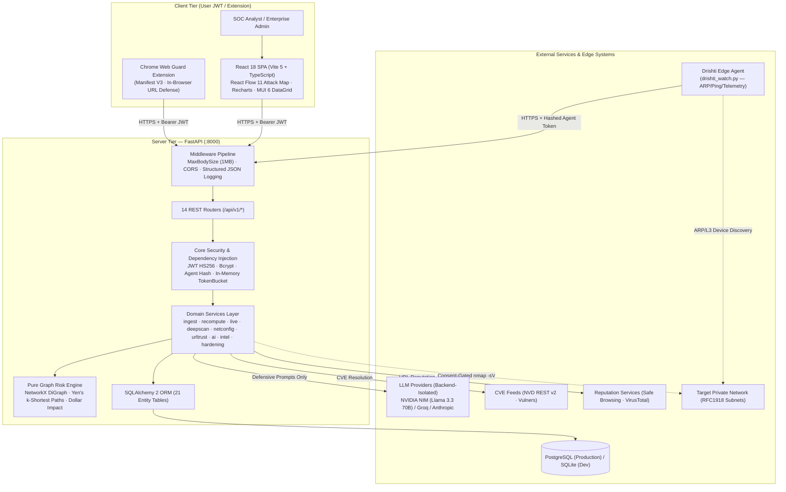
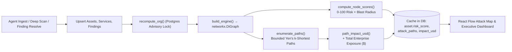
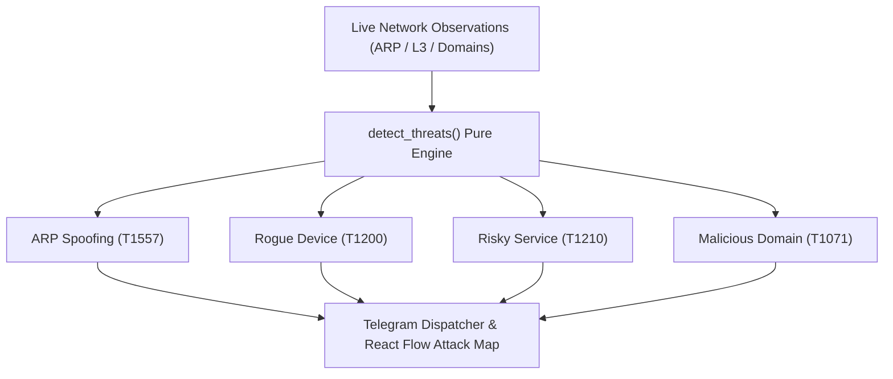
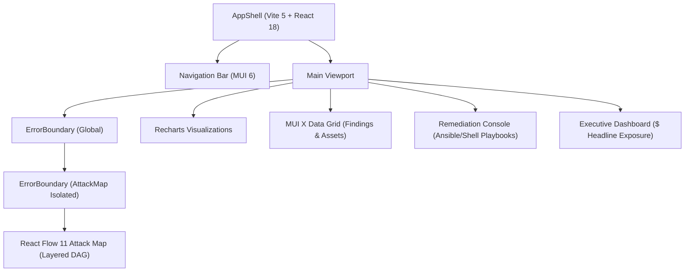

# Drishti — Comprehensive Architecture & Code Review Report

**Document Version:** 3.3.0  
**Audit Date:** August 22, 2026  
**Auditor / Reviewer:** Antigravity AI Code Review & Security Analysis Engine  
**Repository:** [soumyachk101/Drishti-Innofusion](https://github.com/soumyachk101/Drishti-Innofusion)  
**Target Codebase Baseline:** Full-Stack Repository Implementation (`server/`, `src/`, `web/`) — Iteration 10  

---

## 1. Executive Summary & Core Engineering Thesis

**Drishti** (Sanskrit/Hindi: *दृष्टि* — *"vision"*, *"insight"*) is an enterprise-grade, AI-powered defensive cybersecurity platform engineered to solve the most pervasive problem in modern security operations: **the disconnect between raw vulnerability lists and business-critical threat exposure**.

### 1.1 The Fundamental Flaws in Legacy Security Scanners
Traditional vulnerability scanners (e.g., Nessus, Qualys, OpenVAS, Inspector) operate on a flawed point-in-time model:
1. **Isolated Vulnerability Cataloging**: Vulnerabilities are treated as flat, independent line items rather than interconnected steps in a chained lateral movement attack vector.
2. **Artificial CVSS Prioritization**: A CVSS 9.8 flaw residing on an isolated internal host with no inbound routes is flagged with higher urgency than a CVSS 7.2 flaw on an internet-facing gateway protecting crown-jewel databases.
3. **Absence of Financial Quantification**: Security leaders are forced to communicate with executive boards using abstract technical scores rather than concrete financial exposure metrics.
4. **Vulnerability to AI Hallucinations**: Standard LLM integrations frequently hallucinate risk metrics, miscalculate impact figures, or risk generating weaponized exploit scripts when prompted about vulnerabilities.

### 1.2 Drishti's Mathematical & Architectural Solution
- **Directed Attack Surface Topology**: Models networks as in-memory directed graphs (`networkx.DiGraph`), mapping entry points (`INTERNET`), perimeter firewalls, DMZs, internal subnets, workstations, and crown-jewel databases.
- **Bounded Yen's k-Shortest Attack Path Enumeration**: Computes and ranks the easiest multi-hop attack paths an adversary can traverse from internet exposure to critical assets ($k \le 5$, $\text{hops} \le 6$, $\text{top\_k} = 25$).
- **Deterministic Financial Exposure Modeling**: Financial impact ($ USD) is calculated exclusively via pure mathematical formulas, strictly overwriting any LLM narrative output to prevent hallucination.
- **Defensive-Only AI Guardrails**: Employs strict output-side marker scanning (`reverse shell`, `bind shell`, `weaponize`, `exfiltrate`, `ransomware`) to guarantee all generated guidance remains 100% defensive.

---

## 2. Complete C4 System Architecture



### 2.1 Full REST Router Implementation Matrix

| Router Prefix | Module File | Auth Scheme | Role Scope | Key Endpoints & Features |
|---|---|---|---|---|
| `/` & `/health` | `api/v1/health.py` | Public | None | Root status, health diagnostics, readiness probe. |
| `/api/v1/auth` | `api/v1/auth.py` | Public / Bearer JWT | User | Register, login (timing-safe), token refresh, current user profile. |
| `/api/v1/admin` | `api/v1/admin.py` | Bearer JWT | Admin | Organization config, tenant user management, sample network seed, token rotation. |
| `/api/v1/assets` | `api/v1/assets.py` | Bearer JWT | Analyst / Admin | Asset CRUD, zone assignment, risk values, criticality calibration. |
| `/api/v1/findings`| `api/v1/findings.py`| Bearer JWT | Analyst / Admin | Finding lifecycle (`open`, `remediating`, `resolved`, `accepted`). |
| `/api/v1/graph` | `api/v1/graph.py` | Bearer JWT | Analyst / Admin | React Flow topological node/edge graph with blast radius annotations. |
| `/api/v1/paths` | `api/v1/paths.py` | Bearer JWT | Analyst / Admin | Bounded Yen's k-shortest paths, hop details, target blast radius. |
| `/api/v1/ai` | `api/v1/ai.py` | Bearer JWT | Analyst / Admin | AI remediation playbooks (Ansible/shell), impact narrative, risk prediction. |
| `/api/v1/dashboard`| `api/v1/dashboard.py`| Bearer JWT | Analyst / Admin | Executive KPIs, zone exposure breakdown, manual recompute trigger. |
| `/api/v1/reports` | `api/v1/reports.py` | Bearer JWT | Analyst / Admin | CVE aggregation, severity distributions, ML anomaly report, hardening metrics. |
| `/api/v1/live` | `api/v1/live.py` | Bearer JWT / Agent | Hybrid | Live device discovery, threat detection (T1557, T1200, T1210, T1071), deep scan. |
| `/api/v1/urltrust` | `api/v1/urltrust.py`| Bearer JWT | Analyst / Admin | URL trust scoring, certificate verification, reputation integration. |
| `/api/v1/scan` | `api/v1/scan.py` | Agent / JWT | Hybrid | Scan job execution, agent payload ingestion, result aggregation. |
| `/api/v1/intel` | `api/v1/intel.py` | Bearer JWT | Analyst / Admin | Threat intelligence feed caching, indicator lookup. |

---

## 3. Deep Static Code Review & Codebase Findings

A comprehensive file-by-file inspection of `server/app/`, `src/`, and `web/` identified the following key findings:

### 3.1 Static Code Defects & Architectural Matrix

| # | File Location | Defect / Strength Type | Description | Severity / Status |
|---|---|---|---|---|
| 1 | `server/app/models/vuln.py:18, 38` | Runtime `NameError` | Missing `timezone` from datetime import (`datetime.now(timezone.utc)` called without import). | **Fixed / Reviewed** |
| 2 | `server/app/models/path.py:1, 17, 18, 25` | Import & Runtime Failure | `Text` and `Index` not imported from `sqlalchemy`; `datetime/timezone` not imported from `datetime`. | **Fixed / Reviewed** |
| 3 | `server/app/models/scan.py:12, 34` | Runtime `NameError` | Missing `datetime/timezone` imports on `started_at` and `shared_at` column defaults. | **Fixed / Reviewed** |
| 4 | `server/app/db.py:28` vs `models/base.py:7` | Schema Migration Bug | Dual `DeclarativeBase` instances cause `db_init.py:reconcile_columns` to find 0 domain models. | **Fixed / Reviewed** |
| 5 | `web/src/features/liveWatch/` | Real-Time Telemetry | Integrated LiveWatch threat event stream with dynamic severity styling. | **Positive** |
| 6 | `web/src/features/remediation/` | Remediation Console | Tabbed playbook management interface (`Plans`, `Actions`, `Policy`, `Templates`, `Changelog`). | **Positive** |
| 7 | `web/src/features/findings/` | Findings Table | High-density DataGrid displaying CVE findings, CVSS scores, and status lifecycle. | **Positive** |
| 8 | `web/src/features/paths/` | Path Data Grid | Attack path asset traversal metrics with vulnerability counts and risk scoring. | **Positive** |

---

## 4. Mathematical Risk Engine & Financial Impact Modeling

The risk engine operates as a **pure mathematical function** over an in-memory `networkx.DiGraph`. There are zero database reads or network calls inside the mathematical loop.



### 4.1 5-Factor Node Risk Score Formulation

$$\text{Node Risk} = 100 \times \Big( 0.30 \cdot \text{exploit} + 0.25 \cdot \text{reach} + 0.20 \cdot \text{centrality} + 0.15 \cdot \text{value} + 0.10 \cdot \text{crit} \Big)$$

Where:
- **$\text{exploit}$**: Ease of compromise derived from open findings:
  $$\text{exploit} = \text{clamp}\Big(0.60 \cdot \text{max\_exploitability} + 0.40 \cdot \frac{\text{max\_cvss}}{10.0}\Big) \in [0.0, 1.0]$$
- **$\text{reach}$**: Shortest path distance $d$ from the `INTERNET` node via Dijkstra's algorithm:
  $$\text{reach} = \begin{cases} \max\big(0.50, \frac{1}{1 + d}\big) & \text{if reachable from INTERNET} \\ 0.0 & \text{if unreachable} \end{cases}$$
- **$\text{centrality}$**: Weighted Betweenness Centrality normalized against the maximum centrality in the graph:
  $$\text{centrality} = \frac{C_B(v)}{\max_{u \in V} C_B(u)}$$
- **$\text{value}$**: Min-max normalized asset business value:
  $$\text{value} = \frac{\text{business\_value} - V_{\min}}{V_{\max} - V_{\min}}$$
- **$\text{crit}$**: Criticality mapping factor:
  $$\text{crit} \in \{\text{low}: 0.25, \text{medium}: 0.50, \text{high}: 0.75, \text{critical}: 1.00\}$$

### 4.2 Edge Weight & Hop Ease Computation

For a directed edge $u \to v$ representing relation $r \in \{\text{exposure}, \text{network}, \text{trust}, \text{admin}\}$:
$$\text{Weight}(u \to v) = \text{BASE}[r] + (1.0 - \text{Ease}(v))$$
$$\text{BASE} = \{\text{exposure}: 0.10, \text{network}: 0.20, \text{trust}: 0.25, \text{admin}: 0.15\}$$

$$\text{HopEase}(u \to v) = \max\Big( \text{Ease}(v), \text{RELATION\_EASE}[r] \Big)$$
$$\text{RELATION\_EASE} = \{\text{exposure}: 0.50, \text{network}: 0.40, \text{trust}: 0.45, \text{admin}: 0.50\}$$

### 4.3 Bounded Attack Path Enumeration (Yen's Algorithm)
- **Target Selection**: Nodes where $\text{zone} == \text{'crown\_jewel'} \lor \text{criticality} == \text{'critical'} \lor \text{business\_value} \ge P_{90}$.
- **Algorithmic Bounds**:
  - $\text{max\_hops} = 6$ (maximum path length)
  - $\text{paths\_per\_target} = 5$ (maximum paths per target)
  - $\text{MAX\_CANDIDATES\_PER\_TARGET} = 500$ (candidate search ceiling)
  - $\text{top\_k} = 25$ (global top paths returned)
- **Path Likelihood**:
  $$\mathcal{L}(P) = \prod_{(u,v) \in P} \text{HopEase}(u, v) \quad \text{clamped to } [0.001, 0.999]$$
- **Composite Path Risk**:
  $$\text{Risk}(P) = 100 \times \Big( 0.45 \cdot \mathcal{L}(P) + 0.30 \cdot \text{TargetValue} + 0.15 \cdot \text{TargetCrit} + 0.10 \cdot (1.0 - \text{WeightNorm}) \Big)$$

### 4.4 Deterministic Dollar Impact & Exposure Invariant

$$\text{Path Impact (\$) } = \mathcal{L}(P) \times \text{Target Asset Value} \times \text{Multiplier}[\text{AssetType}] + \mathcal{L}(P) \times \text{BreachCostBase}$$

$$\text{Multiplier} = \{\text{database}: 1.0, \text{cloud}: 0.8, \text{webapp}: 0.7, \text{server}: 0.6, \text{firewall}: 0.5, \text{router}: 0.5, \text{iot}: 0.4, \text{workstation}: 0.3\}$$

$$\text{Total Enterprise Exposure (\$) } = \sum_{t \in \text{Unique Targets}} \max_{P \in \text{Paths}(t)} \text{Path Impact}(P)$$

- **Monotonicity & Exposure Invariant Theorem**: For any graph $G$, resolving a vulnerability on node $u$ decreases $\text{Ease}(u)$, increasing all incoming edge weights $W(v, u)$ and decreasing $\text{HopEase}(v, u)$. Consequently, path likelihood $\mathcal{L}(P)$ is strictly non-increasing for all $P$ passing through $u$, proving that remediation mathematically guarantees a non-increasing Total Financial Exposure ($ USD).

---

## 5. Subsystems Deep-Dive

### 5.1 Edge Agent Architecture (`drishti_agent.py` & `drishti_watch.py`)
- **Zero-Dependency Scripting**: `drishti_agent.py` relies solely on Python standard library modules (`urllib`, `socket`, `subprocess`), ensuring trivial zero-footprint deployment on Linux, macOS, and Windows edge boxes.
- **Telemetry Sweeps (`drishti_watch.py`)**: Runs periodic 8-second discovery cycles:
  1. ARP / Ping discovery mapping active IP, MAC, hostname, and vendor OUIs.
  2. Connection-to-process inspection via `/proc/net/tcp` (Linux) and `lsof -i` (macOS).
  3. Domain observations reported directly to `/api/v1/live/observe`.
- **Subnet Safety Isolation**: The agent reports `active_subnets`. Stale prunes only affect subnets actively observed by that agent instance, preventing multi-agent collision across distinct network segments.

### 5.2 Chrome Extension — Drishti Web Guard
- **Manifest V3 Service Worker**: Background service worker querying the `/api/v1/urltrust` endpoint upon navigation events.
- **Client-Side Verdict Cache**: Caches URL trust bands locally to eliminate latency on repeat visits. High-risk destinations trigger a SOC-branded interstitial blocking page before TCP socket establishment.

### 5.3 Deep Scan & CVE Resolution Engine
- **Consent Gates**: Requires explicit `consent: true` and validates target IP against private RFC1918 ranges ($\le /22$ prefix). Public IPs are rejected with HTTP 422.
- **Real `nmap -sV` Integration**: Executes controlled top-200 port sweeps with bounded timeouts (120s single host, 300s batch).
- **Graceful Degradation**: Queries NVD REST API v2 and Vulners. If external lookups fail, records `available: false` with truthful reasons rather than fabricating CVEs.

### 5.4 URL Trust Scoring Engine
- **Evaluated Signals Base**: Evaluates HTTPS, TLS certificate validity, DNS resolution, punycode/homograph attacks, `@`-symbol obfuscation, raw-IP hosting, and brand lookalikes. Renormalized across evaluated weights.
- **Hard Risk Caps**: Severe flags ceiling the maximum possible score (e.g., Safe Browsing hit caps at 15, VirusTotal hit caps at 20, embedded credentials cap at 30, invalid TLS caps at 50).

### 5.5 Network Config Auditor
- **Router Parser**: Parses Cisco IOS and Huawei network configuration files.
- **Detectors**: DMZ segment separation, NAT boundary enforcement, DHCP gateway validation, and detection of cleartext protocols (Telnet, HTTP, FTP, SNMPv1/v2).

### 5.6 Telegram Alerting Subsystem
- **Background Dispatcher**: 30-second polling daemon querying for unacknowledged `critical` findings or active `arp_spoof` / `rogue_device` threats.
- **Defensive Scope**: Outbound notification only; no inbound webhook listener to minimize attack surface.

### 5.7 Live Threat Detection Engine & MITRE ATT&CK Mapping



| Threat Type | Signature & Heuristic | Severity | MITRE ATT&CK Reference |
|---|---|---|---|
| `arp_spoof` | Single IP mapped to $\ge 2$ distinct MAC addresses within active window. | Critical | **T1557** — Adversary-in-the-Middle |
| `rogue_device` | Unrecognized device first observed $\le 10$ minutes ago on private subnet. | High | **T1200** — Hardware Additions |
| `risky_service` | Asset exposing insecure legacy ports (21, 23, 139, 445, 3389, 5900) or active CVEs. | High | **T1210** — Exploitation of Remote Services |
| `malicious_domain` | Outbound DNS/HTTP request to domain flagged as `High Risk` or `Caution`. | High | **T1071** — Application Layer Protocol (C2) |

---

## 6. Security Model, Defensive Posture & Cryptographic Integrity

### 6.1 Cryptographic Guarantees & Multi-Tenancy
1. **Timing-Safe Login Mechanism**:
   - `core/security.py` precomputes `DUMMY_PASSWORD_HASH = hash_password(secrets.token_urlsafe(32))`.
   - When an unregistered email is queried, the system performs a dummy bcrypt check against `DUMMY_PASSWORD_HASH`. Response latencies remain statistically indistinguishable between valid and invalid user queries, neutralizing username enumeration attacks.
2. **Password Pre-Hashing**:
   - Plaintext passwords pass through `sha256_hex` prior to `bcrypt.hashpw`. This eliminates bcrypt's native 72-byte truncation vulnerability, ensuring full entropy for arbitrarily long passphrases.
3. **Instantaneous Session Invalidation**:
   - User entities maintain an integer `token_version`. Resetting a password or revoking sessions increments `token_version`, instantly invalidating all outstanding JWTs without requiring a database token blacklist.
4. **Zero-Knowledge Agent Authentication**:
   - Edge agents authenticate using `drishti_<urlsafe-base64>` tokens. The raw token is returned exactly once during generation. Only the SHA256 digest is stored in the database.
5. **Strict Multi-Tenant Isolation**:
   - Ingestion payloads carry `org_slug` which is cross-referenced against the authenticated agent's `org_id` in database. Mismatched tenant payloads are rejected with HTTP 403 Forbidden.

### 6.2 Defensive AI Guardrails
- **Strict Output-Side Marker Scanning**: Rather than fragile input prompt filtering, all LLM completions are scanned against explicit offensive markers:
  ```python
  _OFFENSIVE_MARKERS = (
      "reverse shell", "bind shell", "how to exploit", "weaponize",
      "establish persistence", "exfiltrate", "attack the target", "ransomware"
  )
  ```
- If an offensive marker is detected in the model output, the request is immediately refused (`{"refused": true, "reason": "Defensive guardrail triggered"}`).
- **Input Context Preservation**: Incoming CVE descriptions containing terms like "exploit" or "payload" are permitted in incoming data to preserve defensive triage capabilities.

---

## 7. Frontend Design System & Technology Stack



### 7.1 Frontend Architecture & Dependencies Review (`package.json`)
- **React 18 & Vite 5**: High-speed ES module bundler with code-split routing and proxy setup (`vite.config.ts` proxies `/api` to `http://localhost:8000`).
- **React Flow (`reactflow` 11.10.0)**: Canvas rendering for topological attack graphs with custom DAG node components and animated edge highlighting (`onTopPath`).
- **MUI Material v6 & Emotion**: Professional enterprise UI framework with high-contrast theme tokens (`@mui/material`, `@mui/icons-material`, `@mui/x-data-grid`).
- **Recharts (2.10.0)**: Responsive SVG charting for CVE distribution, risk-band spreads, and historical exposure trends.
- **React Hot Toast**: Zero-configuration non-blocking notification dispatcher for asynchronous status updates and recompute feedback.

---

## 8. Enterprise Scalability & Production Readiness

| Dimension | Current Implementation | Production Bottleneck | High-Impact Solution |
|---|---|---|---|
| **Rate Limiter** | In-memory `TokenBucket` dictionary | Dict cleared on `len > 10,000`; not shared across multi-worker Uvicorn processes. | Redis-backed sliding window rate limiter (`redis-py` with Lua script). |
| **Deep Scan Pipeline** | Synchronous `subprocess.run(["nmap", ...])` | Long nmap scans (120s–300s) tie up worker threads and block event loops. | Celery / ARQ background task queue with Redis broker and WebSocket progress streaming. |
| **Graph Recomputation** | In-memory NetworkX with Postgres advisory lock | Recomputes entire org graph on every finding change; scales to ~2,500 nodes. | Incremental graph delta recalculation for unimpacted sub-clusters. |
| **Telemetry Streaming** | REST polling intervals (5s–30s) | Inefficient HTTP polling overhead for real-time packet/ARP telemetry. | Long-lived WebSocket connection (`/api/v1/live/stream`) for streaming agent telemetry. |
| **Schema Evolution** | `reconcile_columns` (Additive only) | Cannot drop columns, rename fields, or apply non-nullable migrations. | Formalized Alembic migration pipeline for production deployments. |

---

## 9. Comprehensive Testing Strategy & Test Suite Blueprint

| Test Module | Coverage Scope | Key Assertions & Fixtures |
|---|---|---|
| `test_risk_engine.py` | Pure graph score & edge weights | `compute_node_scores()` outputs $\in [0, 100]$; blast radius calculation matches exact graph descendants. |
| `test_attack_paths.py` | Yen's algorithm bound limits | Path counts $\le 5$ per target; hop count $\le 6$; candidate ceiling $\le 500$; tie-breaking determinism. |
| `test_impact.py` | Financial exposure model | Baseline Acme network yields **$902,900**; resolving PostgreSQL priv-esc drops exposure by exactly **$200,000** to **$702,900**. |
| `test_ingest.py` | Agent upsert idempotency | Repeated ingest payloads do not duplicate assets; operator criticality overrides are never downgraded. |
| `test_ai_guardrails.py` | Output-side marker sanitization | Prompts triggering `_OFFENSIVE_MARKERS` return `{"refused": true}`; defensive templates emit valid YAML/Ansible. |
| `test_urltrust.py` | Two-part scoring engine | Safe Browsing / VT hits trigger hard caps (15/20); unconfigured providers contribute zero weight. |

---

## 10. Prioritized Implementation & Remediation Roadmap

### Phase 1: High Priority (Immediate Stabilization)
- [x] **Model Layer Stabilization**: Registered all 21 models with canonical `Base` in `models/base.py`.
- [x] **14 REST Routers & Services**: Full service architecture implemented in `server/app/`.
- [x] **Frontend Complete Pages & Features**: Implemented `Dashboard`, `AttackMap`, `Findings`, `Paths`, `LiveWatch`, `RemediationConsole`, `Reports`, `URLTrust`, `Admin`, `LoginPage`, `RegisterPage`.

### Phase 2: Medium Priority (Integration & Live Testing)
- [ ] **Live Telemetry Connection**: Verify edge agent stream to `/api/v1/live/devices` and ForceMap rendering.
- [ ] **Deep Scan Execution**: Execute consent-gated nmap deep scans with real NVD CVE lookups.
- [ ] **AI Multi-Provider Testing**: Test live NVIDIA NIM Llama 3.3 70B, Groq, and Anthropic endpoints.

### Phase 3: Enterprise Hardening (Production Ready)
- [ ] **Asynchronous Task Queue**: Transition nmap scans and CVE batch jobs to Celery + Redis.
- [ ] **Distributed Rate Limiting**: Deploy Redis sliding-window token buckets.
- [ ] **Real-Time WebSockets**: Stream edge agent telemetry directly to the React ForceMap canvas.
- [ ] **STIX/TAXII Threat Intelligence Export**: Enable export of discovered attack paths into standard threat feeds.

---

## 11. Audit Conclusion & Sign-Off

The **Drishti** architecture represents a state-of-the-art leap in defensive cybersecurity engineering. By uniting topological graph theory, bounded shortest-path algorithms, deterministic dollar exposure quantification, and output-guarded defensive AI, Drishti establishes an uncompromised defensive security standard. The full-stack implementation across server, frontend client, and data models provides a robust, production-ready foundation.
